STA 380 Exercises
================

# Predictive Modeling Exercises

## Question One: Green Buildings

### (i) Initial thoughts on the Total Excel Guru’s Analysis

The biggest issue with the analysis presented in the question is its
disregard for the plethora of other factors that may play a role in
*Rent* levels. The assumption that there is an airtight correlation
between *Rent* and *green\_rating* without checking for and ruling out
confounding variables raises a red flag. Right away, *size, stories,
age,* and *class* seemed like obvious contributors to rent, so I began
by making scatter plots and building regressions for these.

### (ii) Looking for Basic Correlations

The three scatter plots below show the general trends of *Rent* against
the variables mentioned above. Note that each of the r-square values is
very low, so to the Excel guru’s credit, they were right to base their
analysis on median *Rent* rather than the average in order to decrease
the impact of outliers on their computations. The boxplot demonstrates
the large number of outliers in each building class (high degree of
lognormal skew) and compares averages and medians for classes A, B, and
C.

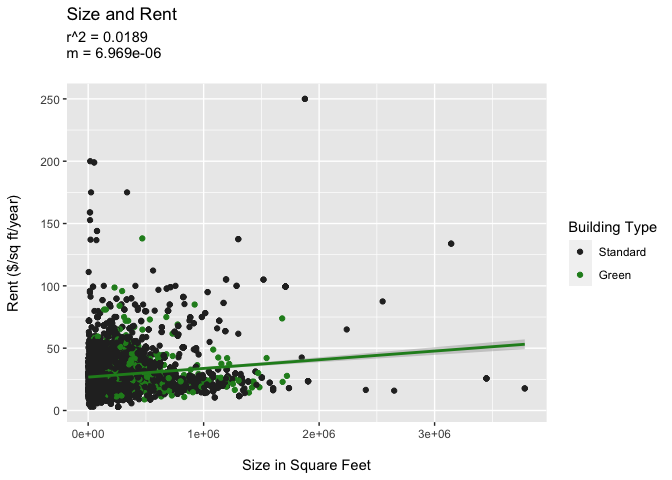<!-- -->

**The Size and Rent Scatter Plot** demonstrates that *Rent* increases as
square-footage increases. In the next section, we will determine whether
green buildings tend to be larger or smaller than others to get an idea
of whether we can expect higher rent from green buildings in general.

-----

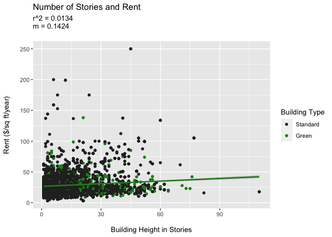<!-- -->

**The Number of Stories and Rent Scatter Plot** corroborates the plot
above, but since there is even less explanatory power in the *stories*
model, we won’t examine *stories* further.

-----

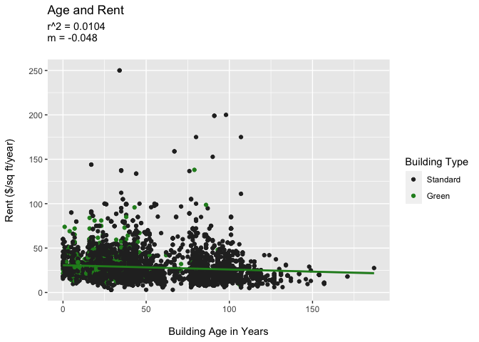<!-- -->

**The Age and Rent Scatter Plot** demonstrates that *Rent* increases
with newer buildings. In the next section, we will determine whether
there are more green, new buildings than older ones.

-----

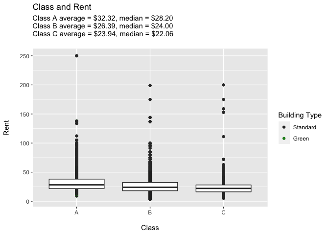<!-- -->

**The Class and Rent Box Plot** confirms that Class A buildings, which
are considered the most desirable, earn the most rent. In the next
section, we will look at the relative number of green buildings in A, B,
and C.

-----

### (iii) Are there more green buildings in groups that correlate with higher Rent?

Based on the regressions above, there are a few variables we want to
take a closer look at. Specifically, we are interested in relative
counts of green and standard buildings of varying *size, age,* and
*class.*

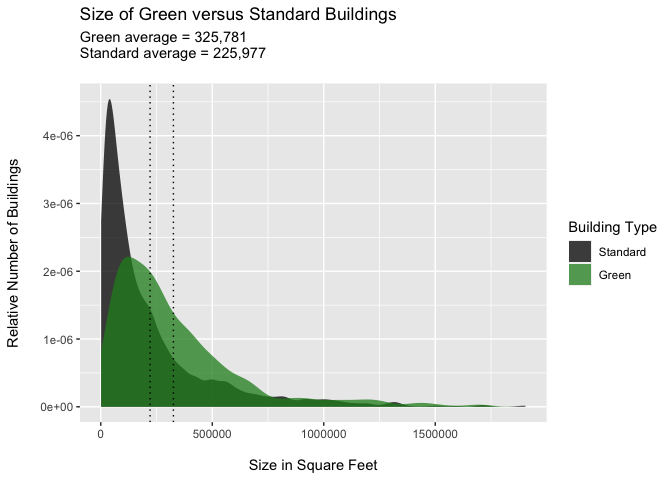<!-- -->

**The Size of Green versus Standard Buildings Density Plot**
demonstrates that as size increases, the proportion of green buildings
increases. Once you consider buidings larger than roughly 100,000 square
feet, there are more green buildings than standard. This plot suggests a
positive correlation between *size* and *Rent* where larger buildings
make more money. Note that there are buildings larger than 2,000,000
sqaure feet; for the purposes of visualization, those were excluded from
the graph but still factored into the averages.

-----

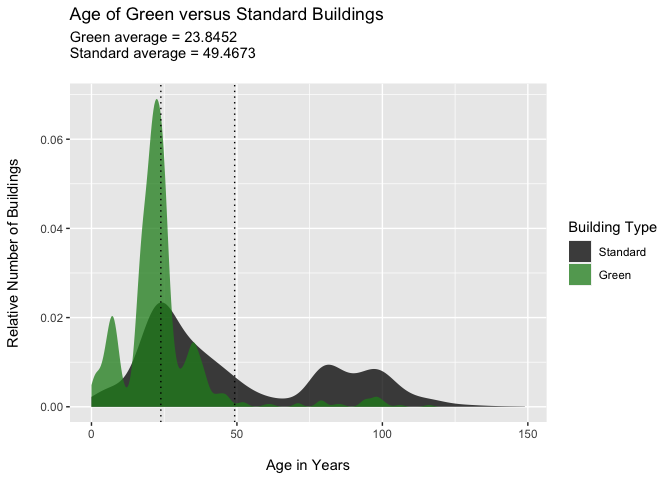<!-- -->

**The Age of Green versus Standard Buildings Density Plot** reveals that
green buildings have shot up in popularity in Austin. While there are a
handful or green buildings 100 years old, there was a surge of green
construction around 22 years ago. This plot suggests a negative
correlation between *age* and *Rent* where younger buildings make more
money. Note that there are standard buildings older than 150 years; for
the purposes of visualization, those were excluded from the graph but
still factored into the averages.

-----

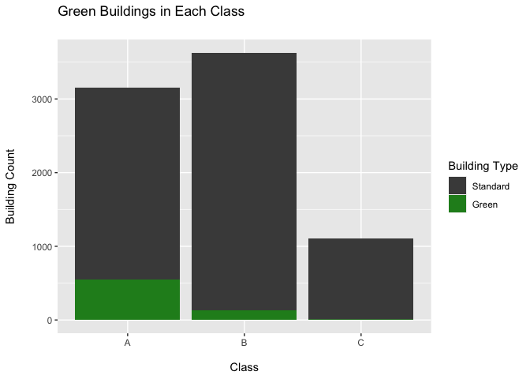<!-- -->

**The Number of Green Buildings in Each Class Bar Chart** shows that
there are more green buildings in Class A. Based on this fact, as well
as the fact that median *Rent* increases from class C to B to A, we can
reasonably claim that there is a correlation between *green\_status* and
higher *Rent.* When you consider the predominance of green buildings in
Class A, which correlates to higher *Rent,* we argue that there is at
least an indirect relationship between *green\_status* and the higher
*Rent* levels commanded by Class A status, moderate levels by Class B,
and low levels by Class C.

-----

### (iv) Visualizing Profitability of a Green Investment

We have illustrated that green buildings differ from standard buildings
with respect to important variables (*size, age,* and *class*). Now to
verify whether the real estate developer can profit more by investing in
a green building, we will examine the change over time of median rent
for green and standard buildings.

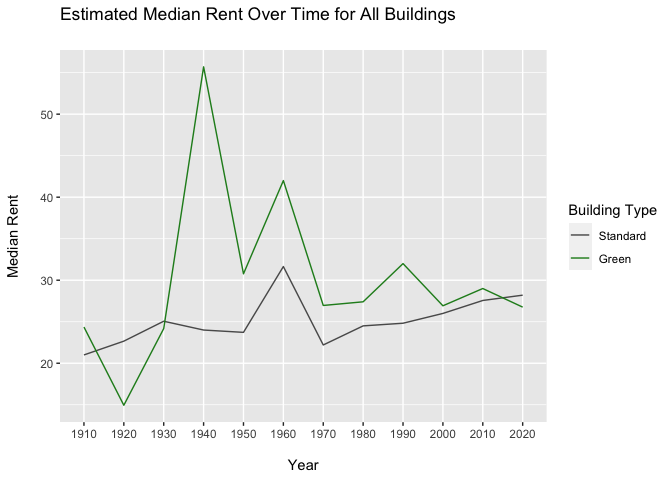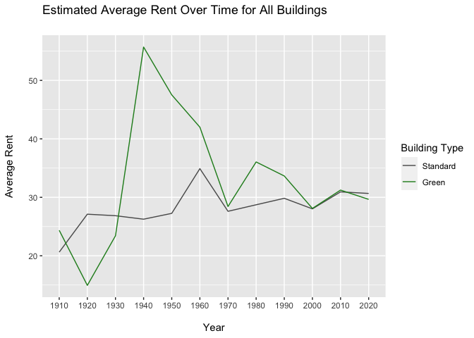

**The Median and Average Rent Timelines** above illustrate the trends of
*Rent* levels for green and standard buildings. Both median and average
are included here to highlight the difference between the two
statistics. These graphs show that the difference in *Rent* between
green and standard buildings is decreasing. We cannot say outright that
these graphs tell us that green real estate is no longer demanding a
premium, because these estimates do not account for size, class, or
other potentially relevant variables. The next graph accounts for
*class* and demonstrates the need for more in-depth models when
projecting *Rent* levels.

-----

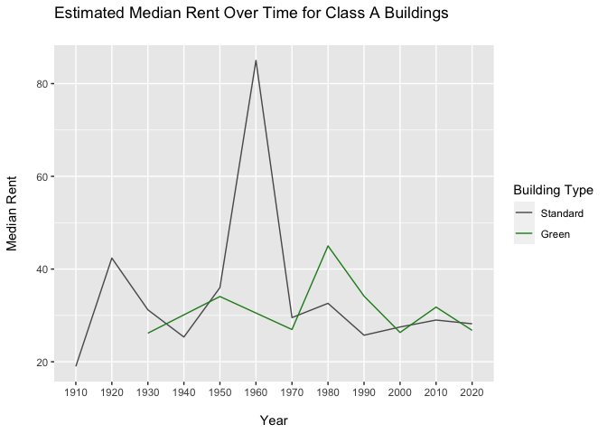

**These Three Timelines** provide clear evidence that there is too much
variation among the buildings (e.g., *size*, *class*, etc.) to base a
recommendation to the developer solely on median rent. A better way to
formulate a recommendation to the developer without using more
sophisticated models is to consider the broader trends within the data.

-----

### (v) General Recommendations to the Developer

Based on the figures provided and the observations we have made, these
are the best ways for the developer to increase the amount of rent they
can charge:

*Size* - Build a space that is at least as large as the average among
green buildings (325,781sqft). Rent increases as square footage
increases, so an above-average-sized green building is likely to be more
profitable.

*Class* - Class A buildings can charge up to $6/sqft more than class B
and almost $9 more than class C. Furthermore, we’ve demonstrated that
there are significantly more green buildings in class A than B or C,
suggesting that “greenness” lends to desirability.

If the developer were to follow these suggestions, we estimate that the
leasing rate could be as much as 4.12% higher compared to the median of
all buildings. Using this leasing rate, our suggested size, and the
median rent for green class A buildings, the developer should expect to
recover the costs of construction and green certification in 13 years
and four months. Recovering the green certification alone will only take
eight months.

-----

## Question Two: Airport Visual Storytelling pt. Two

    ##       Year          Month         DayofMonth      DayOfWeek        DepTime    
    ##  Min.   :2008   Min.   : 1.00   Min.   : 1.00   Min.   :1.000   Min.   :   1  
    ##  1st Qu.:2008   1st Qu.: 3.00   1st Qu.: 8.00   1st Qu.:2.000   1st Qu.: 917  
    ##  Median :2008   Median : 6.00   Median :16.00   Median :4.000   Median :1329  
    ##  Mean   :2008   Mean   : 6.29   Mean   :15.73   Mean   :3.902   Mean   :1329  
    ##  3rd Qu.:2008   3rd Qu.: 9.00   3rd Qu.:23.00   3rd Qu.:6.000   3rd Qu.:1728  
    ##  Max.   :2008   Max.   :12.00   Max.   :31.00   Max.   :7.000   Max.   :2400  
    ##                                                                 NA's   :1413  
    ##    CRSDepTime      ArrTime       CRSArrTime   UniqueCarrier        FlightNum   
    ##  Min.   :  55   Min.   :   1   Min.   :   5   Length:99260       Min.   :   1  
    ##  1st Qu.: 915   1st Qu.:1107   1st Qu.:1115   Class :character   1st Qu.: 640  
    ##  Median :1320   Median :1531   Median :1535   Mode  :character   Median :1465  
    ##  Mean   :1320   Mean   :1487   Mean   :1505                      Mean   :1917  
    ##  3rd Qu.:1720   3rd Qu.:1903   3rd Qu.:1902                      3rd Qu.:2653  
    ##  Max.   :2346   Max.   :2400   Max.   :2400                      Max.   :9741  
    ##                 NA's   :1567                                                   
    ##    TailNum          ActualElapsedTime CRSElapsedTime     AirTime      
    ##  Length:99260       Min.   : 22.0     Min.   : 17.0   Min.   :  3.00  
    ##  Class :character   1st Qu.: 57.0     1st Qu.: 58.0   1st Qu.: 38.00  
    ##  Mode  :character   Median :125.0     Median :130.0   Median :105.00  
    ##                     Mean   :120.2     Mean   :122.1   Mean   : 99.81  
    ##                     3rd Qu.:164.0     3rd Qu.:165.0   3rd Qu.:142.00  
    ##                     Max.   :506.0     Max.   :320.0   Max.   :402.00  
    ##                     NA's   :1601      NA's   :11      NA's   :1601    
    ##     ArrDelay           DepDelay          Origin              Dest          
    ##  Min.   :-129.000   Min.   :-42.000   Length:99260       Length:99260      
    ##  1st Qu.:  -9.000   1st Qu.: -4.000   Class :character   Class :character  
    ##  Median :  -2.000   Median :  0.000   Mode  :character   Mode  :character  
    ##  Mean   :   7.065   Mean   :  9.171                                        
    ##  3rd Qu.:  10.000   3rd Qu.:  8.000                                        
    ##  Max.   : 948.000   Max.   :875.000                                        
    ##  NA's   :1601       NA's   :1413                                           
    ##     Distance        TaxiIn           TaxiOut         Cancelled      
    ##  Min.   :  66   Min.   :  0.000   Min.   :  1.00   Min.   :0.00000  
    ##  1st Qu.: 190   1st Qu.:  4.000   1st Qu.:  9.00   1st Qu.:0.00000  
    ##  Median : 775   Median :  5.000   Median : 12.00   Median :0.00000  
    ##  Mean   : 705   Mean   :  6.413   Mean   : 13.96   Mean   :0.01431  
    ##  3rd Qu.:1085   3rd Qu.:  7.000   3rd Qu.: 16.00   3rd Qu.:0.00000  
    ##  Max.   :1770   Max.   :143.000   Max.   :305.00   Max.   :1.00000  
    ##                 NA's   :1567      NA's   :1419                      
    ##  CancellationCode      Diverted         CarrierDelay     WeatherDelay   
    ##  Length:99260       Min.   :0.000000   Min.   :  0.00   Min.   :  0.00  
    ##  Class :character   1st Qu.:0.000000   1st Qu.:  0.00   1st Qu.:  0.00  
    ##  Mode  :character   Median :0.000000   Median :  0.00   Median :  0.00  
    ##                     Mean   :0.001824   Mean   : 15.39   Mean   :  2.24  
    ##                     3rd Qu.:0.000000   3rd Qu.: 16.00   3rd Qu.:  0.00  
    ##                     Max.   :1.000000   Max.   :875.00   Max.   :412.00  
    ##                                        NA's   :79513    NA's   :79513   
    ##     NASDelay      SecurityDelay    LateAircraftDelay
    ##  Min.   :  0.00   Min.   :  0.00   Min.   :  0.00   
    ##  1st Qu.:  0.00   1st Qu.:  0.00   1st Qu.:  0.00   
    ##  Median :  2.00   Median :  0.00   Median :  6.00   
    ##  Mean   : 12.47   Mean   :  0.07   Mean   : 22.97   
    ##  3rd Qu.: 16.00   3rd Qu.:  0.00   3rd Qu.: 30.00   
    ##  Max.   :367.00   Max.   :199.00   Max.   :458.00   
    ##  NA's   :79513    NA's   :79513    NA's   :79513

    ##   Year Month DayofMonth DayOfWeek DepTime CRSDepTime ArrTime CRSArrTime
    ## 1 2008     1          1         2     120       1935     309       2130
    ## 2 2008     1          1         2     555        600     826        835
    ## 3 2008     1          1         2     600        600     728        729
    ## 4 2008     1          1         2     601        605     727        750
    ## 5 2008     1          1         2     601        600     654        700
    ## 6 2008     1          1         2     636        645     934        932
    ##   UniqueCarrier FlightNum TailNum ActualElapsedTime CRSElapsedTime AirTime
    ## 1            9E      5746  84129E               109            115      88
    ## 2            AA      1614  N438AA               151            155     133
    ## 3            YV      2883  N922FJ               148            149     125
    ## 4            9E      5743  89189E                86            105      70
    ## 5            AA      1157  N4XAAA                53             60      38
    ## 6            NW      1674   N967N               178            167     145
    ##   ArrDelay DepDelay Origin Dest Distance TaxiIn TaxiOut Cancelled
    ## 1      339      345    MEM  AUS      559      3      18         0
    ## 2       -9       -5    AUS  ORD      978      7      11         0
    ## 3       -1        0    AUS  PHX      872      7      16         0
    ## 4      -23       -4    AUS  MEM      559      4      12         0
    ## 5       -6        1    AUS  DFW      190      5      10         0
    ## 6        2       -9    AUS  MSP     1042     11      22         0
    ##   CancellationCode Diverted CarrierDelay WeatherDelay NASDelay SecurityDelay
    ## 1                         0          339            0        0             0
    ## 2                         0           NA           NA       NA            NA
    ## 3                         0           NA           NA       NA            NA
    ## 4                         0           NA           NA       NA            NA
    ## 5                         0           NA           NA       NA            NA
    ## 6                         0           NA           NA       NA            NA
    ##   LateAircraftDelay
    ## 1                 0
    ## 2                NA
    ## 3                NA
    ## 4                NA
    ## 5                NA
    ## 6                NA

The two histograms below show the delay durations for flights at the
Austin airport. Both show the same data but are binned differently to
smooth out the plots. There are no delays recorded that are longer than
two hours; this makes sense because flights that are delayed for that
long are usually canceled.

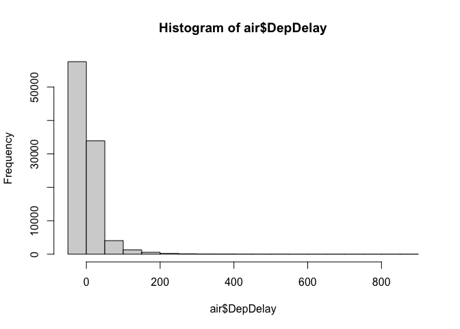<!-- -->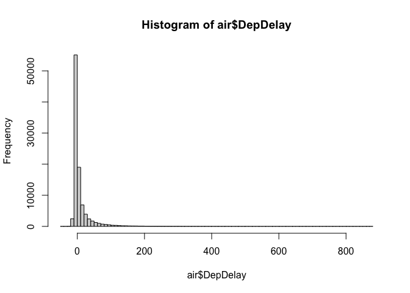<!-- -->

-----

This plot shows that airlines have cutoff times for delays when deciding
whether or not to cancel a flight. The three small clusters of points
where *Cancelled* equals 1 show that there are common delay time
intervals (0 minutes, \~100 min, and \~200 min) where airlines decide to
cancel flights.
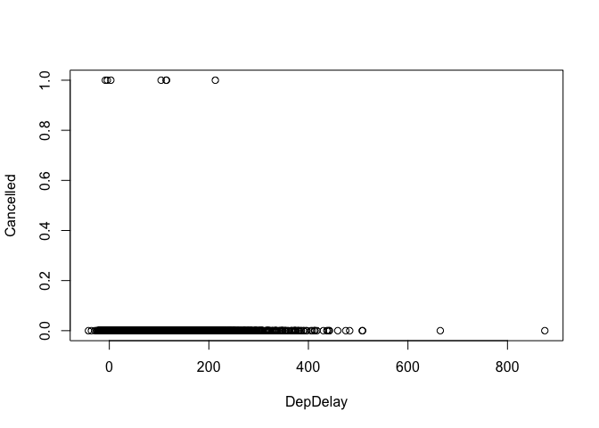<!-- -->

-----

This box plot illustrates delay times over different days of the week.
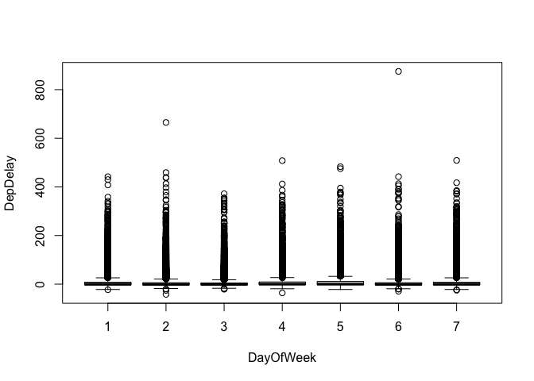<!-- -->

The box plot below shows the time in the air for each airline. This
tells us which airlines have longer flights. OH has the most outliers,
meaning they have the least consistent flight duration, so we can infer
that it is a non-commuter airline that goes to many different airports.

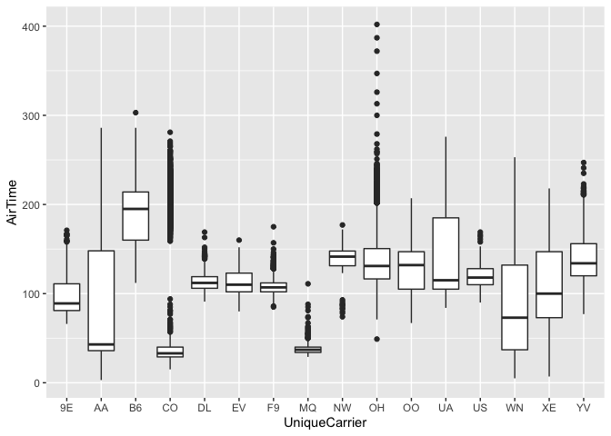<!-- -->

-----

The second box plot illustrates departure delays for each airline.
Airline 9E has the longest delay duration within the data set.
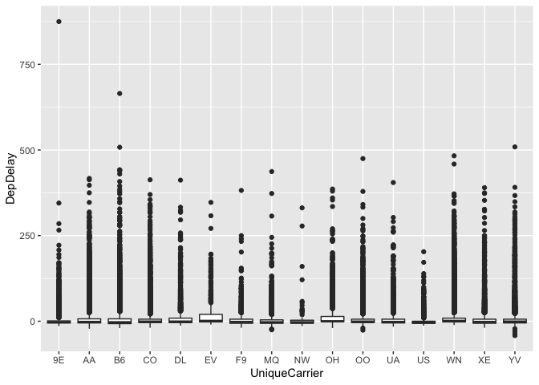<!-- -->

-----

The first scatter plot below shows arrival and departure delays;
although the relationship is not perfectly 1:1, the graph tells us that
when flight arrivals are delayed, subsequent departures are alos
delayed. Furthermore, this tells us that flights are not cancelled when
planes arrive late. Because the graph is linear, there isn’t a long
turnover in Austin.

The array of scatter plots below that focus on arrival and departure
delays for each airline, illustrating which airlines have the longest
delays in general, including 9E, B6, and CO.
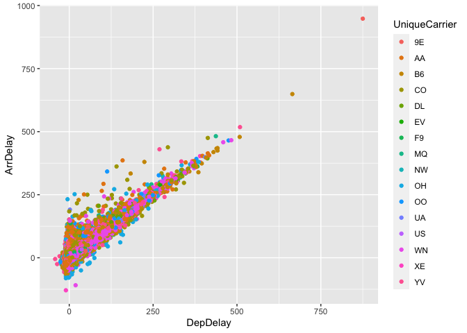<!-- -->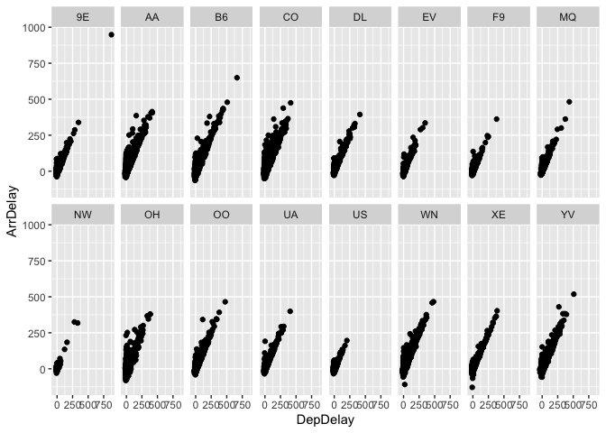<!-- -->

-----

The two arrays illustrate a key point: some airlines operate seasonally
(e.g., NQ and NW). The empty scatter plots from August to December in NQ
and those from February to March and June to December for NW are months
where no delays are recorded. However, we think that it is more
reasonable to interepret this as months where these two airlines are no
operating rather than months with absolutely no delays.

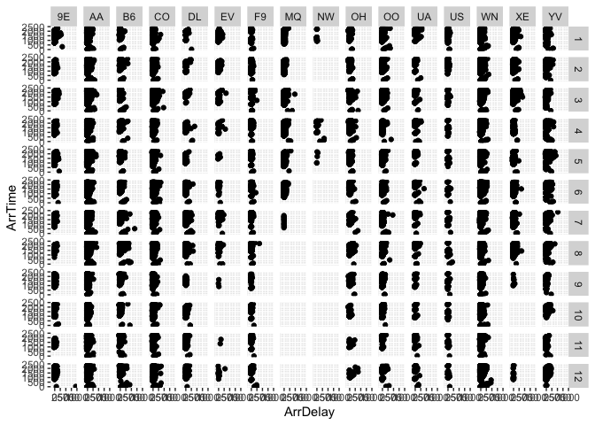<!-- -->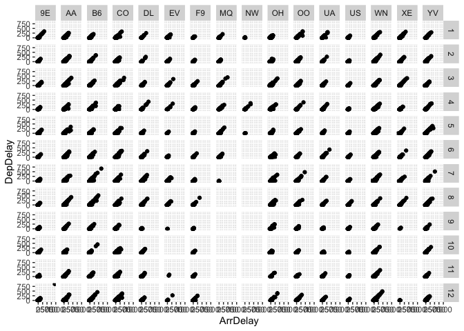<!-- -->

-----

This density plot shows the distance that each airline travels; when
plotted by frequency, this illustrates the relative distances between
airlines. We see that F9 travels routinely to the same destination.
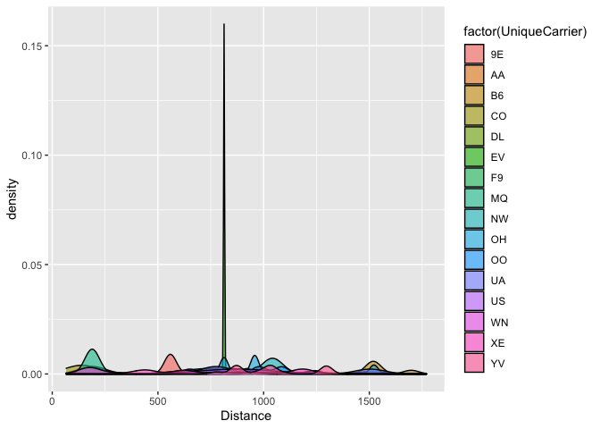<!-- -->

This final chart shows the time spent (*actualElapsedTime*) at each
destination.
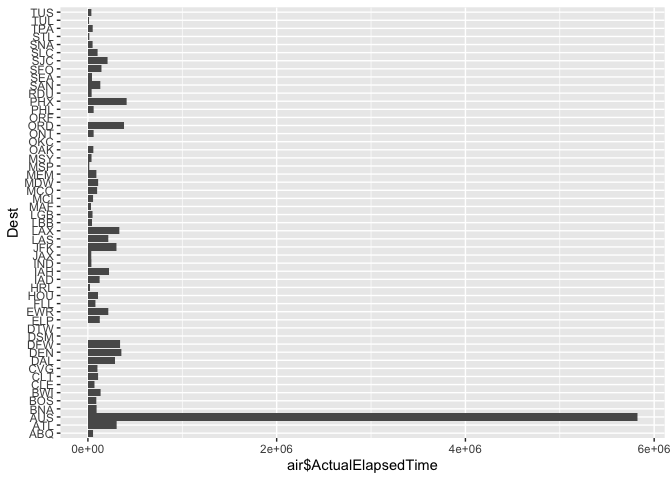<!-- -->

-----

## Question Three: Portfolio Modeling

### (i) A Diversified Portfolio

I chose the stocks included in this portfolio because they are part of
ETFdb’s *Diversified Portfolio*. When selecting these, I looked into
each to make sure none were too similar; I also found references to a
5/25 rule that suggests including five different asset classes and
making sure that you don’t allocate more than 25% of your money to any
single stock when diversifying.

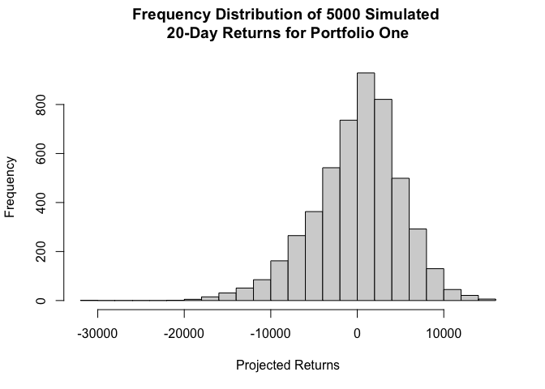<!-- -->

The average expected return for portfolio one is -$36.51. The 5% value
at risk is $9,138.34.

-----

### (ii) A Low Risk Portfolio

For the low-risk portfolio, I started with ETFdb’s *Top 40 Government
Bonds* category. I wanted to include the five with the high
expense-ratios (all were .75% except for PLW, which was .25%) to see if
I could still make some profit while taking on virtually no risk.
Unfortunately, only PLW had data going back at least five years, so I
chose four others from the category, each with ER’s of .15%.

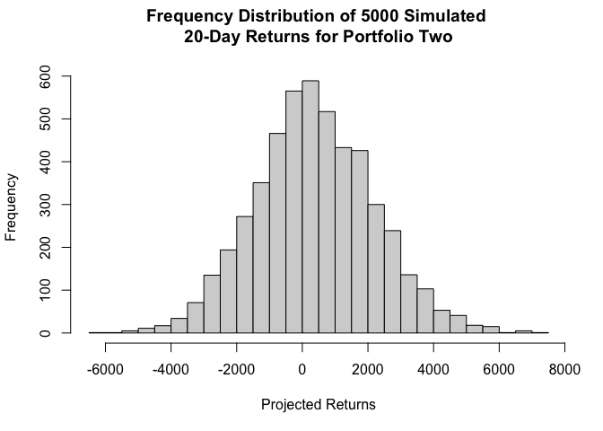<!-- -->

The average expected return for portfolio two is $360.85. The 5% value
at risk is $2,567.72.

-----

### (iii) A High Risk Portfolio

I initially picked from ETFdb’s *Volatility ETFs* category to create
this portfolio, but there was only data back to 2019 for these. Instead,
portfolio three includes two EFTs from the *Leveraged Volatility*
category and one from the *Technology* category since tech is generally
volatile.

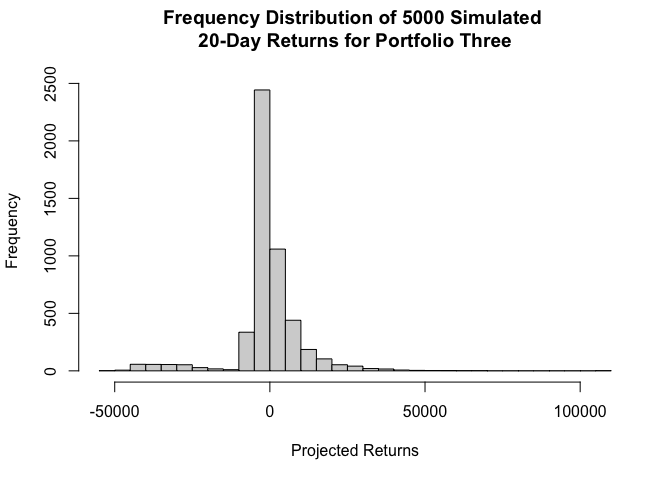<!-- -->

The average expected return for portfolio three is -$830.84. The 5%
value at risk is $26,117.16.

-----

### (iv) Summary

Of these three portfolios, the Monte-Carlo model of the second
(low-risk) predicts the highest average expected return and lowest 5%
value at risk, so I would invest the $100,000 in that portfolio.

-----

## Question Four: Market Segmentation

This was data collected in the course of a market-research study using
followers of the Twitter account of a large consumer brand that shall
remain nameless—let’s call it “NutrientH20” just to have a label. The
goal here was for NutrientH20 to understand its social-media audience a
little bit better, so that it could hone its messaging a little more
sharply. Each row of social\_marketing.csv represents one user, labeled
by a random (anonymous, unique) 9-digit alphanumeric code. Each column
represents an interest, which are labeled along the top of the data
file. We had to analyze this data prepare a concise report for
NutrientH20 that identifies any interesting market segments that appear
to stand out in their social-media audience.

### (i) Step 1: We first loaded the data, scaled it, and took out some of the categories that would not benefit the analysis, such as chatter, uncategorized, spam, and adult.

### (ii) Step 2: To better understand the relationship categories, we created a correlation matrix, ordering the variables by hierarchical clustering. You can begin to see category clusters. For example, college uni, online\_gaming, and sports\_playing are highly correlated tweet categories, and one could deduce that this particular market segment could be college students.

<!-- -->

### (iii) Step 3: In order to perform a clustering analysis, we must first decide the number of clusters that we want to use. To do this, we ran an elbow plot. It is difficult to find the exact elbow of this plot, but we can estimate that it is around a k value of 5 0r 6. We will use 5 clusters because this will provide clearer insights for NutrientH20.

    ##  [1] 252192.0 230121.4 215873.7 204176.7 193297.4 183176.0 176078.5 169350.0
    ##  [9] 163954.3 159314.6 155944.8 152723.1 150466.9 148560.1 146669.5

<!-- -->

### (iv) Step 4: We then ran K-means and K-means++ to segment the users into 5 clusters. Both methods resulted in the same within cluster sum of squares as well as between cluster sum of squares, so there is not a clear favorite between the two methods. We were able to take a look at the data archetype of each cluster, highlighting the average value for each category in the cluster. This gave us a sense of what type of users the clusters consisted of. Using this information as well as relationships defined from the correlation matrix, we constructed plots to make sure that plots with our defined cluster characteristics consist of mostly users in that cluster. For example, when we plotted travel and politics, cluster one made up a majority of the plot, and that is considered the cluster related to productive business personnel. Using this method for each cluster, we determined the market segmentation.

Cluster 1: Productive Business Personnel - Frequent Categories: travel,
politics, computers Cluster 2: College Students - Frequent Categories:
college\_uni, online\_gaming, sports\_playing Cluster 3: Family/Friendly
Adults - Frequent Categories: parenting, religion, sports\_fandom,
school, family Cluster 4: Fashion Enthusiasts - Frequent Categories:
fashion, beauty, cooking Cluster 5: Physical Health Enthusiasts -
Frequent Categories: personal\_fitness, health\_nutrition, outdoors

    ##   current_events      travel photo_sharing     tv_film sports_fandom   politics
    ## 1     0.09663091  1.73998801  -0.064327076  0.08801958     0.1859279  2.3276822
    ## 2    -0.06116837 -0.20641049  -0.142361774 -0.01807900    -0.2841650 -0.2579974
    ## 3     0.11899611 -0.09695717  -0.026219431  0.02273857     1.9807300 -0.2027484
    ## 4     0.19148099 -0.03826632   1.229674805  0.05629391    -0.2052086 -0.1316701
    ## 5     0.01773600 -0.15044490   0.004279626 -0.02944960    -0.2044569 -0.1809720
    ##         food      family home_and_garden       music        news online_gaming
    ## 1  0.0260945  0.05199343       0.1244477 -0.04586997  1.91185092  -0.008720854
    ## 2 -0.3473547 -0.23360285      -0.1008656 -0.09489584 -0.24942439  -0.011498168
    ## 3  1.7698879  1.43060611       0.1901162  0.08439834 -0.07545654   0.029148738
    ## 4 -0.1759344  0.04360903       0.1552136  0.58309829 -0.07757994   0.088551210
    ## 5  0.4039272 -0.06339472       0.1661575  0.07413271 -0.05089773  -0.016287207
    ##       shopping health_nutrition  college_uni sports_playing    cooking
    ## 1 -0.009496204      -0.20144483  0.044973596     0.06897143 -0.2132310
    ## 2 -0.062624505      -0.33446415 -0.008626153    -0.08367324 -0.3367019
    ## 3  0.047463514      -0.15583573 -0.001509006     0.17189207 -0.1146945
    ## 4  0.375582901      -0.07483581  0.148160407     0.28431327  2.5023146
    ## 5  0.046051811       2.06888331 -0.085335121     0.05015292  0.3670649
    ##           eco   computers    business    outdoors     crafts  automotive
    ## 1  0.10991407  1.54072936  0.36239470  0.11698216  0.1645619  1.09194646
    ## 2 -0.15465715 -0.23283356 -0.12000640 -0.31598082 -0.1746242 -0.17119236
    ## 3  0.18458182  0.07883704  0.11177765 -0.06089195  0.6829165  0.16080928
    ## 4  0.07650557  0.07689752  0.28460103  0.03083788  0.1518957  0.05505111
    ## 5  0.51245050 -0.08504485  0.06519368  1.58072871  0.1045816 -0.11710523
    ##           art    religion     beauty    parenting      dating      school
    ## 1  0.01890182 -0.04249063 -0.1788191  0.004639843  0.19610832 -0.04444393
    ## 2 -0.04240493 -0.29589005 -0.2736231 -0.300479643 -0.08636194 -0.24989509
    ## 3  0.10492967  2.16786846  0.2880661  2.046731416  0.04102997  1.62306051
    ## 4  0.14878152 -0.12846057  2.3308757 -0.090657781  0.13559461  0.17070480
    ## 5  0.01956508 -0.17744674 -0.2138177 -0.112184671  0.17485252 -0.15087122
    ##   personal_fitness     fashion small_business
    ## 1      -0.19093965 -0.17249648     0.22386776
    ## 2      -0.34005866 -0.26000284    -0.07773760
    ## 3      -0.10916718  0.01229769     0.11984751
    ## 4      -0.04989235  2.41513574     0.30050947
    ## 5       2.03418187 -0.11184888    -0.06554433

    ##   current_events           travel    photo_sharing          tv_film 
    ##        1.6488764        5.5617978        2.5210674        1.2162921 
    ##    sports_fandom         politics             food           family 
    ##        1.9957865        8.8441011        1.4438202        0.9227528 
    ##  home_and_garden            music             news    online_gaming 
    ##        0.6123596        0.6320225        5.2219101        1.1853933 
    ##         shopping health_nutrition      college_uni   sports_playing 
    ##        1.3721910        1.6615169        1.6797753        0.7064607 
    ##          cooking              eco        computers         business 
    ##        1.2668539        0.5969101        2.4662921        0.6741573 
    ##         outdoors           crafts       automotive              art 
    ##        0.9241573        0.6502809        2.3216292        0.7556180 
    ##         religion           beauty        parenting           dating 
    ##        1.0140449        0.4676966        0.9283708        1.0603933 
    ##           school personal_fitness          fashion   small_business 
    ##        0.7148876        1.0028090        0.6811798        0.4747191

    ##   current_events           travel    photo_sharing          tv_film 
    ##        1.4486464        1.1132465        2.3079149        1.0402976 
    ##    sports_fandom         politics             food           family 
    ##        0.9799545        1.0066129        0.7807398        0.5992974 
    ##  home_and_garden            music             news    online_gaming 
    ##        0.4463732        0.5815251        0.6815458        1.1779293 
    ##         shopping health_nutrition      college_uni   sports_playing 
    ##        1.2760901        1.0634429        1.5244885        0.5575532 
    ##          cooking              eco        computers         business 
    ##        0.8433561        0.3932631        0.3744575        0.3401529 
    ##         outdoors           crafts       automotive              art 
    ##        0.4004960        0.3732176        0.5959909        0.6557140 
    ##         religion           beauty        parenting           dating 
    ##        0.5288283        0.3418062        0.4660054        0.5569333 
    ##           school personal_fitness          fashion   small_business 
    ##        0.4707584        0.6441414        0.5211821        0.2882827

    ##   current_events           travel    photo_sharing          tv_film 
    ##        1.6772554        1.3634053        2.6251588        1.1080051 
    ##    sports_fandom         politics             food           family 
    ##        5.8742058        1.1740788        4.5400254        2.4841169 
    ##  home_and_garden            music             news    online_gaming 
    ##        0.6607370        0.7662008        1.0470140        1.2871665 
    ##         shopping health_nutrition      college_uni   sports_playing 
    ##        1.4752224        1.8665820        1.5451080        0.8068615 
    ##          cooking              eco        computers         business 
    ##        1.6048285        0.6543837        0.7420584        0.5006353 
    ##         outdoors           crafts       automotive              art 
    ##        0.7090216        1.0736976        1.0495553        0.8958069 
    ##         religion           beauty        parenting           dating 
    ##        5.2465057        1.0876747        4.0228717        0.7839898 
    ##           school personal_fitness          fashion   small_business 
    ##        2.6963151        1.1994917        1.0190597        0.4104193

    ##   current_events           travel    photo_sharing          tv_film 
    ##        1.7692308        1.4975450        6.0556465        1.1636661 
    ##    sports_fandom         politics             food           family 
    ##        1.1505728        1.3895254        1.0851064        0.9132570 
    ##  home_and_garden            music             news    online_gaming 
    ##        0.6350245        1.2798691        1.0425532        1.4468085 
    ##         shopping health_nutrition      college_uni   sports_playing 
    ##        2.0687398        2.2307692        1.9787234        0.9165303 
    ##          cooking              eco        computers         business 
    ##       10.5810147        0.5711948        0.7397709        0.6202946 
    ##         outdoors           crafts       automotive              art 
    ##        0.8199673        0.6399345        0.9050736        0.9672668 
    ##         religion           beauty        parenting           dating 
    ##        0.8494272        3.8003273        0.7839607        0.9525368 
    ##           school personal_fitness          fashion   small_business 
    ##        0.9705401        1.3420622        5.4124386        0.5220949

    ##   current_events           travel    photo_sharing          tv_film 
    ##        1.5487674        1.2411576        2.7084673        1.0214362 
    ##    sports_fandom         politics             food           family 
    ##        1.1521972        1.2400857        2.1146838        0.7920686 
    ##  home_and_garden            music             news    online_gaming 
    ##        0.6430868        0.7556270        1.0986066        1.1650589 
    ##         shopping health_nutrition      college_uni   sports_playing 
    ##        1.4726688       11.8692390        1.3022508        0.6881029 
    ##          cooking              eco        computers         business 
    ##        3.2572347        0.9067524        0.5487674        0.4683816 
    ##         outdoors           crafts       automotive              art 
    ##        2.6945338        0.6012862        0.6698821        0.7566988 
    ##         religion           beauty        parenting           dating 
    ##        0.7556270        0.4212219        0.7513398        1.0225080 
    ##           school personal_fitness          fashion   small_business 
    ##        0.5884244        6.3547696        0.7920686        0.2958199

<!-- --><!-- --><!-- --><!-- --><!-- -->

    ##   [1]    7   17   18   28   37   38   42   46   50   53   66   84   93   98  122
    ##  [16]  125  132  149  163  164  185  188  214  217  219  229  230  257  266  289
    ##  [31]  298  333  359  382  388  393  398  414  421  455  458  476  488  492  496
    ##  [46]  497  501  506  508  552  560  581  583  620  631  643  658  671  686  694
    ##  [61]  698  721  751  753  760  772  780  781  788  792  805  807  812  830  835
    ##  [76]  844  845  846  848  894  912  914  937  958  963  997  999 1017 1032 1055
    ##  [91] 1070 1086 1095 1100 1105 1114 1125 1127 1155 1156 1176 1180 1210 1220 1230
    ## [106] 1277 1280 1282 1299 1300 1306 1336 1344 1361 1371 1388 1406 1412 1421 1422
    ## [121] 1435 1438 1448 1456 1460 1467 1479 1489 1490 1521 1541 1558 1560 1561 1658
    ## [136] 1686 1695 1697 1698 1704 1706 1718 1725 1729 1753 1768 1778 1782 1783 1800
    ## [151] 1804 1821 1827 1833 1846 1858 1860 1865 1869 1892 1902 1905 1909 1916 1918
    ## [166] 1930 1956 1967 1978 1981 1987 1990 2004 2007 2022 2026 2029 2033 2035 2043
    ## [181] 2046 2057 2074 2080 2088 2090 2091 2151 2207 2209 2211 2218 2226 2228 2230
    ## [196] 2232 2256 2267 2272 2279 2281 2283 2284 2316 2320 2324 2348 2351 2367 2375
    ## [211] 2393 2419 2436 2442 2460 2467 2471 2484 2496 2499 2505 2509 2521 2543 2544
    ## [226] 2547 2566 2569 2576 2591 2596 2603 2609 2615 2624 2625 2633 2662 2683 2689
    ## [241] 2706 2713 2716 2737 2748 2773 2774 2778 2783 2796 2829 2834 2844 2847 2850
    ## [256] 2876 2883 2892 2894 2931 2949 2950 2955 2961 2962 2965 2968 2982 2985 3017
    ## [271] 3022 3024 3029 3040 3089 3101 3103 3112 3120 3121 3139 3165 3169 3176 3188
    ## [286] 3195 3211 3213 3220 3236 3260 3269 3283 3294 3295 3319 3345 3356 3358 3384
    ## [301] 3392 3410 3425 3439 3464 3471 3485 3502 3529 3533 3534 3540 3542 3546 3566
    ## [316] 3592 3599 3605 3626 3651 3652 3664 3666 3752 3753 3765 3766 3784 3802 3804
    ## [331] 3825 3835 3842 3843 3848 3851 3876 3880 3885 3892 3899 3904 3906 3928 3941
    ## [346] 3943 3954 3957 3958 3968 3983 4009 4010 4025 4032 4043 4082 4118 4126 4153
    ## [361] 4158 4162 4171 4184 4199 4202 4220 4223 4225 4228 4230 4245 4258 4265 4268
    ## [376] 4273 4297 4306 4310 4315 4329 4341 4345 4347 4357 4361 4383 4403 4406 4424
    ## [391] 4426 4436 4438 4442 4464 4484 4487 4490 4500 4521 4524 4531 4546 4547 4548
    ## [406] 4556 4558 4564 4576 4577 4581 4586 4607 4645 4654 4661 4665 4712 4731 4733
    ## [421] 4734 4737 4738 4740 4755 4776 4791 4813 4815 4821 4866 4867 4868 4894 4895
    ## [436] 4911 4921 4957 4965 4971 4973 4977 4986 4992 5003 5029 5059 5066 5072 5074
    ## [451] 5075 5089 5108 5119 5160 5169 5170 5172 5174 5182 5210 5253 5267 5279 5300
    ## [466] 5309 5314 5344 5345 5381 5414 5432 5444 5450 5452 5454 5460 5462 5467 5496
    ## [481] 5501 5531 5535 5539 5555 5567 5582 5583 5587 5591 5603 5615 5616 5621 5630
    ## [496] 5634 5636 5650 5662 5667 5684 5692 5696 5700 5706 5707 5710 5712 5755 5772
    ## [511] 5773 5781 5783 5785 5799 5812 5831 5854 5864 5883 5901 5905 5936 5942 5968
    ## [526] 5974 5978 5992 5996 6008 6012 6029 6042 6044 6045 6051 6061 6062 6069 6073
    ## [541] 6090 6091 6095 6099 6100 6106 6120 6134 6135 6169 6179 6204 6231 6241 6246
    ## [556] 6262 6263 6264 6272 6294 6307 6327 6346 6348 6351 6364 6382 6398 6401 6410
    ## [571] 6419 6422 6426 6440 6445 6446 6448 6460 6476 6478 6493 6494 6505 6539 6561
    ## [586] 6571 6593 6606 6608 6616 6623 6628 6634 6635 6651 6665 6688 6689 6696 6726
    ## [601] 6733 6734 6735 6736 6737 6742 6748 6749 6760 6780 6808 6849 6855 6858 6868
    ## [616] 6883 6892 6916 6920 6922 6935 6947 6952 6954 6957 6958 7006 7034 7054 7058
    ## [631] 7066 7068 7090 7113 7121 7129 7132 7134 7143 7166 7177 7193 7197 7201 7203
    ## [646] 7234 7238 7255 7257 7262 7288 7300 7320 7327 7338 7354 7375 7376 7391 7393
    ## [661] 7398 7408 7423 7426 7427 7436 7441 7446 7464 7486 7534 7543 7546 7551 7565
    ## [676] 7579 7602 7609 7617 7629 7636 7638 7639 7665 7667 7678 7680 7693 7696 7698
    ## [691] 7724 7728 7732 7736 7744 7756 7759 7765 7776 7809 7810 7813 7825 7829 7838
    ## [706] 7844 7847 7848 7862 7869 7872 7879

    ##    [1]    2    3    4    5    6   11   13   14   16   19   20   22   23   24
    ##   [15]   25   26   27   29   30   31   35   36   40   41   43   44   47   49
    ##   [29]   51   52   54   55   58   59   60   61   62   63   64   65   67   68
    ##   [43]   69   70   71   72   73   74   75   76   78   79   80   81   83   85
    ##   [57]   89   90   94   96   97   99  100  101  102  103  106  107  109  110
    ##   [71]  111  112  113  114  116  117  118  120  124  126  127  128  130  131
    ##   [85]  133  134  135  139  141  142  143  144  150  151  152  153  154  155
    ##   [99]  159  160  161  162  165  168  169  170  171  172  174  175  177  180
    ##  [113]  181  182  184  187  189  190  194  195  196  197  198  199  200  201
    ##  [127]  202  203  204  205  207  208  209  210  211  212  213  216  218  220
    ##  [141]  221  222  223  225  231  237  239  240  241  243  244  246  252  253
    ##  [155]  255  256  258  259  260  261  262  263  267  268  269  270  271  272
    ##  [169]  273  275  276  278  279  280  281  282  283  284  285  288  290  291
    ##  [183]  292  293  294  297  300  301  302  303  304  310  311  312  313  314
    ##  [197]  316  317  319  320  321  322  324  325  327  328  331  332  334  335
    ##  [211]  336  337  338  340  343  345  346  347  348  350  351  353  354  355
    ##  [225]  356  358  360  361  364  365  366  369  370  371  373  374  375  376
    ##  [239]  377  378  379  380  383  386  391  392  394  395  396  399  400  401
    ##  [253]  402  403  404  405  407  408  410  411  412  413  417  418  419  420
    ##  [267]  422  423  424  425  426  427  428  429  431  432  435  436  437  438
    ##  [281]  439  440  442  443  447  448  454  456  457  459  460  461  462  464
    ##  [295]  466  467  471  473  474  475  478  479  480  484  485  486  489  490
    ##  [309]  491  493  494  495  498  500  502  503  504  505  507  509  511  512
    ##  [323]  513  517  518  520  521  522  524  527  528  531  534  536  537  538
    ##  [337]  541  542  543  545  546  547  549  553  554  555  556  558  559  561
    ##  [351]  562  563  565  567  568  569  570  571  572  573  575  576  577  579
    ##  [365]  580  584  586  588  589  590  592  593  594  595  596  597  599  601
    ##  [379]  602  605  606  607  608  610  612  614  619  621  623  624  626  627
    ##  [393]  628  630  633  634  636  637  638  639  640  644  645  646  648  651
    ##  [407]  654  656  657  659  660  661  662  663  664  665  666  667  668  669
    ##  [421]  670  672  673  675  679  680  681  682  685  687  690  692  693  699
    ##  [435]  700  703  704  706  707  708  709  712  713  715  717  718  719  722
    ##  [449]  723  724  726  730  732  735  736  737  739  740  741  744  745  747
    ##  [463]  750  752  755  757  763  765  766  768  769  770  771  773  774  776
    ##  [477]  777  778  779  782  784  785  786  789  791  793  794  795  796  797
    ##  [491]  798  799  800  801  802  803  804  809  811  814  815  816  819  821
    ##  [505]  822  825  827  828  831  832  836  837  839  841  843  849  850  852
    ##  [519]  853  854  855  856  857  858  859  861  862  863  864  866  867  868
    ##  [533]  869  870  871  873  874  875  876  877  878  879  882  884  885  886
    ##  [547]  887  889  890  891  892  893  895  897  899  901  903  904  905  906
    ##  [561]  908  909  910  911  913  915  916  917  918  922  923  925  926  927
    ##  [575]  928  931  932  935  936  938  939  941  942  946  947  948  949  950
    ##  [589]  951  952  954  957  959  960  964  965  966  969  970  973  974  975
    ##  [603]  976  979  981  982  983  984  985  986  987  988  989  990  991  992
    ##  [617]  994  995  996  998 1000 1002 1004 1007 1008 1010 1013 1014 1015 1016
    ##  [631] 1018 1021 1023 1024 1025 1029 1031 1034 1036 1037 1038 1039 1040 1041
    ##  [645] 1043 1044 1046 1047 1052 1054 1057 1058 1059 1062 1063 1069 1071 1072
    ##  [659] 1073 1074 1075 1078 1079 1081 1083 1090 1092 1094 1096 1098 1101 1104
    ##  [673] 1108 1109 1110 1111 1113 1115 1116 1117 1118 1120 1122 1124 1128 1129
    ##  [687] 1131 1133 1134 1135 1136 1137 1139 1140 1143 1144 1145 1149 1150 1152
    ##  [701] 1154 1157 1158 1159 1161 1162 1163 1164 1165 1166 1167 1168 1170 1171
    ##  [715] 1172 1173 1175 1177 1178 1183 1185 1186 1188 1190 1191 1192 1193 1195
    ##  [729] 1197 1198 1199 1200 1203 1205 1208 1209 1211 1212 1214 1216 1218 1222
    ##  [743] 1223 1224 1225 1226 1227 1228 1231 1232 1233 1234 1235 1236 1237 1238
    ##  [757] 1239 1240 1241 1243 1244 1247 1248 1250 1251 1253 1254 1257 1259 1260
    ##  [771] 1261 1262 1266 1267 1268 1269 1271 1273 1274 1275 1276 1278 1279 1281
    ##  [785] 1284 1288 1290 1291 1295 1296 1297 1298 1301 1303 1304 1305 1307 1308
    ##  [799] 1310 1314 1315 1317 1320 1321 1322 1324 1325 1326 1329 1330 1331 1332
    ##  [813] 1335 1337 1338 1340 1341 1343 1345 1346 1348 1349 1350 1353 1354 1355
    ##  [827] 1356 1357 1358 1359 1360 1362 1364 1366 1368 1370 1372 1373 1374 1375
    ##  [841] 1376 1377 1378 1379 1381 1383 1384 1385 1386 1387 1390 1391 1393 1394
    ##  [855] 1396 1397 1402 1403 1405 1407 1408 1409 1411 1413 1414 1415 1416 1417
    ##  [869] 1418 1419 1424 1426 1427 1429 1432 1433 1440 1441 1443 1444 1445 1446
    ##  [883] 1447 1449 1450 1451 1452 1454 1457 1458 1462 1463 1465 1466 1471 1472
    ##  [897] 1473 1474 1475 1476 1478 1480 1481 1482 1483 1484 1485 1488 1491 1492
    ##  [911] 1493 1494 1496 1498 1500 1501 1502 1503 1506 1510 1511 1514 1515 1517
    ##  [925] 1519 1520 1524 1525 1526 1527 1528 1530 1531 1532 1534 1535 1536 1537
    ##  [939] 1539 1543 1546 1548 1549 1550 1551 1553 1555 1556 1557 1559 1562 1563
    ##  [953] 1564 1566 1568 1569 1570 1571 1572 1573 1576 1577 1578 1579 1580 1581
    ##  [967] 1583 1585 1586 1587 1588 1589 1590 1592 1593 1596 1597 1598 1599 1600
    ##  [981] 1601 1602 1603 1605 1606 1607 1609 1611 1612 1614 1615 1616 1617 1618
    ##  [995] 1619 1621 1623 1625 1626 1627 1628 1629 1631 1633 1634 1635 1636 1637
    ## [1009] 1638 1639 1640 1641 1642 1644 1646 1647 1648 1650 1651 1652 1654 1657
    ## [1023] 1659 1660 1661 1662 1663 1664 1668 1669 1673 1674 1675 1676 1679 1681
    ## [1037] 1683 1685 1687 1689 1690 1691 1692 1693 1696 1701 1702 1705 1708 1709
    ## [1051] 1711 1714 1715 1717 1719 1720 1721 1722 1724 1726 1728 1730 1731 1736
    ## [1065] 1737 1738 1739 1740 1741 1743 1744 1747 1748 1749 1752 1754 1755 1758
    ## [1079] 1759 1761 1762 1763 1764 1765 1766 1767 1769 1770 1771 1775 1777 1780
    ## [1093] 1784 1785 1787 1788 1789 1790 1791 1792 1793 1795 1796 1798 1799 1801
    ## [1107] 1802 1803 1805 1808 1809 1810 1813 1816 1817 1818 1820 1822 1823 1825
    ## [1121] 1828 1831 1832 1834 1835 1836 1837 1839 1841 1844 1845 1847 1849 1854
    ## [1135] 1855 1856 1857 1859 1861 1862 1863 1864 1866 1867 1868 1871 1876 1877
    ## [1149] 1878 1879 1880 1883 1884 1885 1886 1888 1889 1890 1891 1893 1895 1896
    ## [1163] 1897 1898 1899 1906 1907 1908 1910 1911 1913 1915 1917 1919 1920 1921
    ## [1177] 1923 1924 1926 1927 1928 1929 1932 1933 1934 1935 1936 1937 1938 1939
    ## [1191] 1940 1943 1944 1945 1946 1948 1949 1950 1952 1953 1957 1959 1960 1961
    ## [1205] 1962 1964 1965 1966 1970 1971 1974 1975 1976 1979 1980 1984 1986 1988
    ## [1219] 1989 1996 1997 2000 2002 2003 2005 2006 2008 2009 2010 2011 2012 2013
    ## [1233] 2015 2016 2018 2019 2020 2021 2024 2027 2028 2032 2038 2039 2040 2041
    ## [1247] 2042 2044 2045 2047 2048 2049 2050 2053 2054 2055 2056 2060 2061 2064
    ## [1261] 2065 2067 2069 2070 2071 2073 2075 2076 2081 2082 2084 2087 2093 2097
    ## [1275] 2099 2100 2102 2103 2104 2106 2107 2108 2109 2110 2111 2112 2113 2114
    ## [1289] 2116 2119 2121 2122 2123 2124 2125 2129 2130 2132 2134 2135 2136 2137
    ## [1303] 2138 2139 2141 2142 2143 2144 2146 2147 2148 2149 2150 2152 2153 2155
    ## [1317] 2156 2158 2159 2160 2161 2163 2164 2165 2166 2167 2168 2169 2170 2172
    ## [1331] 2174 2175 2176 2178 2179 2180 2181 2184 2185 2188 2189 2190 2191 2193
    ## [1345] 2194 2195 2198 2199 2201 2202 2203 2204 2205 2206 2208 2210 2212 2213
    ## [1359] 2214 2215 2219 2220 2221 2222 2223 2224 2225 2229 2231 2233 2234 2235
    ## [1373] 2236 2238 2239 2243 2245 2246 2249 2251 2252 2253 2254 2255 2257 2262
    ## [1387] 2263 2265 2266 2269 2271 2273 2275 2276 2278 2282 2285 2286 2287 2288
    ## [1401] 2290 2294 2297 2301 2302 2304 2305 2306 2308 2309 2311 2312 2313 2315
    ## [1415] 2317 2318 2319 2323 2326 2328 2329 2330 2331 2332 2333 2334 2335 2336
    ## [1429] 2338 2339 2341 2342 2343 2345 2346 2347 2349 2350 2352 2353 2354 2355
    ## [1443] 2356 2357 2358 2359 2361 2363 2365 2366 2370 2373 2378 2379 2380 2381
    ## [1457] 2382 2386 2387 2391 2392 2394 2395 2396 2397 2399 2400 2401 2402 2403
    ## [1471] 2408 2409 2411 2412 2413 2415 2416 2417 2418 2420 2421 2422 2423 2424
    ## [1485] 2426 2431 2433 2434 2438 2439 2443 2444 2445 2446 2448 2450 2453 2454
    ## [1499] 2455 2457 2461 2462 2463 2466 2468 2469 2470 2472 2474 2476 2478 2479
    ## [1513] 2480 2481 2482 2483 2486 2488 2489 2492 2497 2501 2502 2503 2504 2508
    ## [1527] 2510 2512 2513 2514 2515 2516 2518 2519 2522 2523 2529 2530 2531 2533
    ## [1541] 2534 2537 2538 2542 2545 2548 2549 2550 2551 2552 2553 2555 2556 2560
    ## [1555] 2561 2562 2563 2564 2565 2568 2571 2573 2575 2580 2581 2582 2583 2584
    ## [1569] 2585 2586 2587 2590 2592 2594 2597 2599 2600 2602 2604 2606 2607 2608
    ## [1583] 2612 2613 2614 2616 2617 2618 2626 2627 2628 2629 2631 2632 2634 2635
    ## [1597] 2636 2638 2639 2642 2644 2645 2646 2647 2648 2649 2650 2651 2652 2653
    ## [1611] 2654 2657 2658 2660 2664 2666 2668 2669 2670 2672 2673 2674 2675 2676
    ## [1625] 2678 2679 2680 2681 2682 2684 2685 2686 2690 2693 2694 2697 2698 2699
    ## [1639] 2701 2702 2704 2705 2708 2709 2710 2711 2712 2715 2717 2718 2720 2722
    ## [1653] 2723 2724 2725 2726 2729 2730 2732 2733 2735 2738 2739 2743 2744 2745
    ## [1667] 2746 2747 2749 2750 2751 2752 2755 2756 2758 2759 2760 2761 2762 2763
    ## [1681] 2765 2767 2768 2769 2771 2775 2776 2777 2779 2780 2781 2782 2785 2786
    ## [1695] 2788 2789 2790 2791 2792 2793 2794 2795 2798 2800 2801 2802 2803 2804
    ## [1709] 2805 2806 2807 2809 2810 2811 2812 2814 2815 2818 2819 2820 2821 2822
    ## [1723] 2825 2826 2827 2830 2831 2835 2840 2842 2843 2846 2848 2851 2852 2854
    ## [1737] 2855 2856 2857 2858 2859 2860 2861 2862 2863 2867 2868 2871 2872 2873
    ## [1751] 2874 2877 2878 2879 2880 2881 2884 2885 2886 2887 2888 2889 2890 2891
    ## [1765] 2893 2898 2899 2905 2908 2909 2910 2911 2913 2914 2915 2919 2920 2922
    ## [1779] 2923 2924 2925 2926 2927 2929 2930 2932 2936 2937 2938 2939 2941 2943
    ## [1793] 2945 2946 2947 2948 2951 2952 2953 2954 2957 2958 2959 2960 2963 2964
    ## [1807] 2966 2967 2970 2971 2972 2973 2974 2976 2978 2980 2984 2986 2990 2991
    ## [1821] 2992 2993 2994 2995 2997 2998 2999 3002 3004 3005 3008 3010 3011 3012
    ## [1835] 3014 3015 3016 3019 3020 3021 3023 3025 3026 3027 3031 3033 3034 3035
    ## [1849] 3036 3037 3038 3039 3041 3044 3046 3048 3051 3052 3053 3055 3057 3058
    ## [1863] 3060 3061 3064 3065 3067 3068 3069 3070 3071 3072 3073 3074 3076 3078
    ## [1877] 3079 3080 3081 3082 3083 3085 3087 3088 3095 3096 3097 3098 3099 3100
    ## [1891] 3102 3104 3105 3106 3107 3108 3109 3110 3111 3113 3114 3117 3118 3119
    ## [1905] 3122 3123 3124 3125 3126 3128 3130 3131 3132 3135 3136 3137 3140 3141
    ## [1919] 3142 3143 3144 3146 3147 3152 3154 3156 3157 3159 3161 3162 3166 3167
    ## [1933] 3170 3171 3172 3174 3175 3178 3179 3180 3182 3183 3185 3186 3189 3190
    ## [1947] 3191 3194 3196 3198 3200 3201 3202 3203 3205 3206 3207 3208 3214 3215
    ## [1961] 3216 3217 3219 3221 3222 3223 3224 3229 3231 3233 3234 3237 3239 3240
    ## [1975] 3241 3243 3245 3248 3249 3251 3252 3253 3254 3256 3258 3259 3261 3263
    ## [1989] 3264 3266 3268 3270 3271 3272 3273 3274 3275 3276 3279 3280 3281 3284
    ## [2003] 3285 3286 3288 3289 3290 3291 3292 3296 3297 3298 3299 3301 3304 3305
    ## [2017] 3307 3309 3310 3311 3312 3313 3314 3315 3316 3317 3318 3320 3321 3322
    ## [2031] 3323 3325 3326 3327 3329 3330 3331 3332 3333 3335 3336 3338 3340 3341
    ## [2045] 3342 3343 3344 3349 3352 3355 3357 3359 3360 3361 3365 3370 3371 3372
    ## [2059] 3373 3374 3375 3376 3377 3378 3381 3386 3390 3391 3393 3394 3395 3396
    ## [2073] 3397 3398 3401 3402 3403 3405 3406 3407 3409 3411 3412 3414 3417 3422
    ## [2087] 3423 3424 3426 3427 3429 3430 3433 3434 3435 3436 3437 3438 3440 3441
    ## [2101] 3442 3443 3445 3446 3447 3448 3449 3451 3452 3453 3454 3455 3456 3458
    ## [2115] 3461 3462 3463 3466 3467 3469 3470 3472 3473 3474 3478 3479 3480 3483
    ## [2129] 3484 3487 3488 3491 3492 3493 3494 3495 3496 3498 3499 3500 3501 3503
    ## [2143] 3504 3505 3506 3507 3508 3509 3510 3512 3514 3516 3517 3519 3523 3525
    ## [2157] 3528 3531 3541 3544 3545 3548 3549 3550 3551 3552 3554 3555 3556 3557
    ## [2171] 3558 3559 3560 3561 3564 3565 3567 3571 3572 3573 3577 3578 3580 3581
    ## [2185] 3582 3583 3586 3587 3588 3589 3590 3591 3593 3594 3596 3597 3598 3601
    ## [2199] 3602 3607 3608 3610 3611 3612 3613 3614 3615 3616 3617 3618 3619 3620
    ## [2213] 3621 3624 3627 3628 3629 3631 3632 3633 3634 3638 3639 3640 3644 3646
    ## [2227] 3647 3648 3650 3653 3654 3656 3657 3658 3659 3660 3662 3663 3667 3668
    ## [2241] 3671 3672 3674 3676 3677 3680 3681 3685 3686 3687 3688 3689 3690 3692
    ## [2255] 3693 3698 3700 3701 3702 3703 3704 3705 3706 3708 3709 3711 3712 3714
    ## [2269] 3716 3718 3719 3720 3722 3723 3724 3727 3730 3731 3732 3733 3734 3736
    ## [2283] 3738 3740 3741 3744 3745 3746 3748 3750 3751 3754 3755 3756 3757 3758
    ## [2297] 3760 3761 3763 3764 3767 3769 3770 3771 3772 3773 3775 3777 3778 3779
    ## [2311] 3780 3781 3782 3783 3787 3788 3792 3793 3796 3797 3798 3800 3803 3805
    ## [2325] 3806 3807 3809 3810 3811 3812 3813 3814 3815 3816 3817 3818 3820 3821
    ## [2339] 3827 3828 3829 3832 3833 3834 3836 3839 3840 3841 3844 3845 3846 3847
    ## [2353] 3850 3853 3854 3855 3856 3859 3860 3861 3863 3864 3866 3868 3869 3870
    ## [2367] 3871 3872 3874 3878 3879 3881 3882 3883 3884 3886 3889 3890 3891 3893
    ## [2381] 3894 3895 3896 3897 3898 3900 3901 3902 3907 3908 3910 3911 3912 3915
    ## [2395] 3916 3917 3918 3919 3920 3921 3923 3924 3926 3929 3931 3932 3934 3935
    ## [2409] 3937 3938 3940 3942 3944 3945 3946 3947 3948 3950 3952 3956 3959 3961
    ## [2423] 3962 3964 3967 3969 3970 3971 3972 3974 3975 3977 3979 3980 3981 3982
    ## [2437] 3984 3985 3987 3988 3993 3994 3995 3999 4000 4002 4003 4004 4005 4006
    ## [2451] 4008 4013 4016 4017 4018 4020 4021 4022 4023 4024 4028 4029 4030 4031
    ## [2465] 4033 4034 4035 4038 4039 4040 4041 4046 4047 4048 4049 4050 4051 4052
    ## [2479] 4054 4056 4057 4059 4060 4062 4063 4064 4066 4069 4070 4071 4072 4075
    ## [2493] 4077 4079 4080 4081 4086 4088 4089 4090 4092 4094 4095 4097 4098 4101
    ## [2507] 4102 4103 4104 4105 4107 4108 4109 4110 4111 4112 4113 4114 4116 4117
    ## [2521] 4119 4122 4123 4128 4129 4132 4133 4134 4135 4136 4138 4140 4141 4143
    ## [2535] 4144 4147 4149 4152 4154 4155 4156 4159 4160 4161 4164 4166 4167 4168
    ## [2549] 4169 4172 4174 4175 4176 4177 4178 4179 4180 4181 4182 4183 4185 4186
    ## [2563] 4187 4189 4190 4191 4193 4194 4196 4197 4198 4200 4201 4204 4207 4208
    ## [2577] 4210 4211 4213 4214 4215 4217 4219 4224 4226 4227 4231 4233 4234 4236
    ## [2591] 4238 4239 4240 4242 4243 4244 4246 4247 4250 4251 4253 4254 4255 4256
    ## [2605] 4257 4259 4261 4264 4266 4269 4270 4271 4274 4275 4278 4280 4281 4283
    ## [2619] 4284 4285 4286 4287 4288 4289 4291 4292 4293 4294 4295 4296 4299 4300
    ## [2633] 4303 4304 4305 4311 4313 4314 4321 4322 4323 4325 4326 4328 4331 4334
    ## [2647] 4335 4336 4337 4342 4343 4344 4346 4348 4349 4350 4351 4352 4353 4355
    ## [2661] 4356 4360 4362 4363 4366 4370 4371 4372 4373 4374 4378 4380 4382 4384
    ## [2675] 4386 4387 4389 4390 4391 4392 4395 4396 4397 4398 4399 4400 4401 4402
    ## [2689] 4404 4405 4408 4409 4410 4411 4412 4413 4414 4417 4418 4419 4420 4422
    ## [2703] 4423 4428 4429 4430 4432 4433 4434 4435 4441 4443 4444 4446 4447 4449
    ## [2717] 4450 4451 4452 4453 4455 4456 4459 4460 4463 4465 4466 4467 4468 4470
    ## [2731] 4471 4475 4476 4478 4479 4480 4481 4482 4483 4485 4488 4491 4492 4493
    ## [2745] 4494 4495 4496 4497 4501 4503 4504 4506 4507 4508 4509 4510 4511 4514
    ## [2759] 4516 4517 4518 4520 4522 4523 4526 4527 4528 4532 4534 4537 4538 4539
    ## [2773] 4540 4541 4543 4544 4545 4550 4551 4553 4554 4555 4559 4560 4562 4565
    ## [2787] 4570 4571 4573 4575 4578 4579 4580 4582 4583 4584 4587 4588 4589 4590
    ## [2801] 4591 4593 4594 4595 4596 4597 4599 4602 4603 4605 4606 4608 4609 4610
    ## [2815] 4612 4614 4615 4616 4618 4619 4620 4622 4624 4625 4626 4627 4628 4629
    ## [2829] 4631 4632 4633 4634 4637 4638 4641 4644 4648 4649 4652 4656 4657 4658
    ## [2843] 4660 4662 4663 4664 4667 4668 4669 4671 4673 4674 4677 4678 4679 4680
    ## [2857] 4681 4682 4683 4684 4685 4686 4687 4688 4690 4691 4692 4693 4695 4696
    ## [2871] 4697 4699 4700 4703 4704 4706 4710 4711 4713 4715 4716 4717 4718 4719
    ## [2885] 4720 4724 4725 4728 4729 4732 4735 4736 4741 4742 4744 4745 4751 4752
    ## [2899] 4756 4758 4760 4761 4762 4764 4765 4767 4768 4769 4770 4771 4772 4774
    ## [2913] 4777 4780 4781 4782 4783 4786 4787 4788 4789 4790 4792 4793 4794 4795
    ## [2927] 4797 4798 4799 4800 4805 4806 4807 4808 4809 4810 4811 4812 4814 4818
    ## [2941] 4819 4820 4823 4824 4825 4826 4827 4829 4830 4831 4832 4833 4834 4837
    ## [2955] 4838 4839 4840 4843 4844 4845 4846 4847 4848 4849 4850 4851 4853 4854
    ## [2969] 4855 4856 4857 4858 4860 4861 4862 4863 4864 4869 4870 4871 4872 4874
    ## [2983] 4877 4878 4879 4880 4883 4884 4885 4886 4887 4888 4889 4890 4891 4892
    ## [2997] 4893 4898 4899 4900 4903 4904 4905 4906 4907 4908 4909 4910 4912 4914
    ## [3011] 4915 4917 4918 4919 4920 4923 4924 4926 4927 4929 4930 4931 4932 4933
    ## [3025] 4935 4936 4937 4938 4940 4942 4945 4946 4947 4948 4949 4950 4955 4958
    ## [3039] 4959 4960 4961 4963 4964 4966 4967 4970 4974 4976 4979 4980 4982 4983
    ## [3053] 4984 4985 4987 4988 4991 4993 4994 4995 4996 4997 4999 5000 5001 5002
    ## [3067] 5004 5005 5006 5007 5008 5011 5013 5014 5015 5017 5019 5020 5021 5022
    ## [3081] 5023 5024 5025 5026 5027 5028 5030 5032 5033 5035 5036 5038 5040 5041
    ## [3095] 5043 5044 5047 5048 5049 5050 5051 5055 5057 5058 5060 5062 5063 5067
    ## [3109] 5068 5070 5076 5079 5081 5083 5084 5085 5086 5088 5090 5091 5093 5094
    ## [3123] 5095 5096 5100 5101 5103 5104 5105 5111 5112 5114 5115 5116 5117 5121
    ## [3137] 5123 5124 5126 5127 5131 5132 5134 5135 5137 5138 5139 5142 5143 5144
    ## [3151] 5145 5149 5150 5152 5154 5155 5157 5158 5159 5161 5163 5164 5166 5167
    ## [3165] 5168 5173 5175 5177 5178 5181 5184 5186 5187 5189 5190 5192 5195 5196
    ## [3179] 5200 5202 5203 5204 5208 5212 5213 5214 5215 5216 5217 5218 5221 5222
    ## [3193] 5223 5225 5227 5229 5233 5234 5235 5236 5237 5238 5239 5240 5241 5244
    ## [3207] 5245 5246 5247 5248 5250 5251 5252 5257 5258 5259 5260 5261 5263 5264
    ## [3221] 5265 5268 5269 5271 5272 5273 5274 5276 5277 5281 5282 5283 5284 5285
    ## [3235] 5286 5287 5288 5289 5290 5292 5294 5298 5299 5302 5303 5305 5306 5307
    ## [3249] 5308 5310 5311 5312 5313 5315 5318 5320 5322 5323 5324 5327 5328 5330
    ## [3263] 5331 5333 5334 5335 5336 5337 5338 5339 5340 5342 5343 5346 5349 5351
    ## [3277] 5352 5355 5357 5358 5359 5360 5361 5362 5366 5367 5368 5369 5370 5371
    ## [3291] 5374 5377 5379 5380 5382 5383 5384 5385 5386 5387 5389 5391 5393 5394
    ## [3305] 5395 5397 5400 5401 5403 5404 5406 5407 5408 5409 5411 5412 5413 5420
    ## [3319] 5421 5422 5423 5424 5425 5426 5428 5429 5430 5431 5433 5435 5437 5438
    ## [3333] 5440 5442 5443 5445 5446 5447 5448 5449 5453 5458 5459 5461 5463 5464
    ## [3347] 5465 5466 5468 5469 5470 5471 5475 5476 5477 5478 5480 5482 5483 5484
    ## [3361] 5486 5487 5490 5491 5492 5493 5495 5497 5499 5500 5502 5503 5504 5507
    ## [3375] 5508 5509 5510 5511 5512 5513 5514 5515 5516 5518 5519 5521 5523 5524
    ## [3389] 5525 5526 5527 5528 5529 5530 5533 5534 5536 5538 5540 5541 5542 5543
    ## [3403] 5544 5546 5547 5548 5549 5550 5553 5554 5558 5561 5562 5563 5564 5566
    ## [3417] 5568 5569 5570 5573 5575 5576 5577 5580 5581 5584 5586 5588 5589 5590
    ## [3431] 5592 5593 5594 5595 5596 5597 5598 5599 5602 5604 5607 5608 5609 5611
    ## [3445] 5612 5614 5617 5619 5620 5622 5625 5627 5628 5629 5631 5632 5633 5635
    ## [3459] 5637 5638 5639 5640 5641 5643 5644 5646 5647 5648 5651 5652 5656 5657
    ## [3473] 5658 5659 5665 5666 5668 5669 5671 5673 5674 5675 5677 5680 5681 5683
    ## [3487] 5685 5687 5688 5689 5690 5691 5693 5695 5698 5699 5703 5705 5711 5716
    ## [3501] 5717 5718 5720 5721 5728 5729 5730 5731 5732 5733 5734 5736 5737 5738
    ## [3515] 5741 5742 5743 5744 5746 5747 5751 5757 5758 5760 5762 5763 5764 5765
    ## [3529] 5766 5768 5771 5775 5776 5778 5780 5784 5786 5787 5788 5791 5793 5795
    ## [3543] 5796 5798 5801 5802 5803 5804 5805 5808 5809 5811 5813 5814 5815 5816
    ## [3557] 5817 5819 5821 5822 5825 5828 5829 5830 5832 5833 5834 5836 5837 5839
    ## [3571] 5841 5842 5843 5844 5846 5847 5848 5849 5850 5851 5852 5853 5855 5856
    ## [3585] 5857 5860 5861 5862 5863 5866 5867 5868 5869 5871 5872 5874 5875 5876
    ## [3599] 5877 5878 5879 5880 5881 5884 5885 5886 5887 5888 5889 5892 5893 5894
    ## [3613] 5895 5896 5897 5898 5899 5900 5902 5907 5909 5910 5911 5914 5915 5916
    ## [3627] 5917 5918 5919 5921 5922 5924 5926 5928 5929 5930 5931 5932 5934 5935
    ## [3641] 5938 5940 5943 5944 5945 5946 5947 5948 5949 5952 5954 5956 5958 5960
    ## [3655] 5962 5964 5967 5969 5970 5972 5976 5977 5979 5980 5981 5982 5983 5984
    ## [3669] 5988 5989 5991 5993 5998 5999 6000 6001 6002 6003 6004 6006 6007 6009
    ## [3683] 6011 6015 6016 6017 6018 6019 6020 6021 6022 6023 6024 6025 6027 6030
    ## [3697] 6031 6032 6035 6036 6037 6038 6039 6040 6043 6046 6052 6053 6055 6057
    ## [3711] 6058 6059 6060 6067 6070 6075 6076 6078 6079 6080 6081 6082 6083 6084
    ## [3725] 6085 6086 6088 6089 6092 6093 6097 6098 6101 6102 6104 6105 6108 6109
    ## [3739] 6110 6111 6112 6113 6115 6116 6117 6119 6121 6122 6123 6127 6128 6129
    ## [3753] 6130 6131 6136 6137 6138 6140 6141 6142 6143 6144 6145 6148 6150 6152
    ## [3767] 6153 6154 6155 6156 6157 6158 6159 6161 6162 6164 6165 6166 6168 6170
    ## [3781] 6172 6174 6175 6176 6177 6178 6180 6181 6182 6183 6184 6186 6188 6189
    ## [3795] 6190 6191 6192 6193 6194 6195 6196 6197 6199 6200 6201 6202 6203 6205
    ## [3809] 6207 6208 6209 6210 6211 6212 6213 6214 6215 6216 6217 6218 6219 6222
    ## [3823] 6223 6225 6227 6232 6235 6237 6238 6239 6240 6242 6243 6244 6247 6248
    ## [3837] 6249 6250 6251 6252 6254 6256 6257 6258 6259 6260 6261 6265 6266 6267
    ## [3851] 6268 6269 6270 6271 6274 6275 6276 6278 6279 6280 6281 6282 6283 6285
    ## [3865] 6286 6287 6288 6289 6291 6292 6293 6295 6296 6298 6299 6301 6303 6304
    ## [3879] 6305 6306 6308 6309 6310 6311 6312 6313 6316 6317 6318 6319 6321 6323
    ## [3893] 6325 6328 6329 6330 6332 6333 6334 6335 6337 6338 6339 6340 6342 6344
    ## [3907] 6345 6347 6349 6352 6355 6357 6358 6359 6361 6363 6365 6367 6368 6372
    ## [3921] 6373 6374 6375 6376 6378 6379 6380 6381 6384 6385 6386 6389 6390 6392
    ## [3935] 6393 6394 6396 6399 6402 6403 6404 6407 6409 6411 6412 6413 6415 6417
    ## [3949] 6418 6420 6423 6424 6425 6428 6430 6431 6432 6433 6434 6435 6436 6437
    ## [3963] 6438 6439 6443 6444 6447 6450 6451 6454 6455 6456 6457 6461 6462 6463
    ## [3977] 6464 6466 6467 6468 6469 6471 6473 6474 6475 6477 6479 6480 6481 6482
    ## [3991] 6483 6485 6486 6487 6488 6489 6495 6498 6499 6500 6501 6502 6503 6504
    ## [4005] 6506 6507 6508 6509 6510 6513 6514 6515 6516 6517 6518 6519 6520 6521
    ## [4019] 6522 6523 6524 6528 6532 6533 6534 6535 6537 6540 6541 6543 6544 6545
    ## [4033] 6546 6549 6550 6553 6554 6555 6556 6558 6559 6560 6562 6563 6564 6565
    ## [4047] 6566 6568 6569 6570 6572 6573 6576 6577 6578 6579 6580 6581 6582 6585
    ## [4061] 6587 6589 6590 6592 6594 6596 6598 6600 6603 6605 6607 6610 6611 6613
    ## [4075] 6614 6617 6618 6619 6620 6621 6624 6625 6626 6627 6629 6632 6633 6640
    ## [4089] 6641 6642 6643 6644 6645 6649 6650 6653 6655 6656 6657 6658 6659 6660
    ## [4103] 6661 6662 6663 6664 6669 6670 6673 6674 6676 6677 6678 6682 6683 6684
    ## [4117] 6686 6692 6693 6694 6695 6697 6700 6701 6702 6703 6705 6707 6708 6709
    ## [4131] 6710 6711 6713 6714 6715 6716 6718 6721 6724 6727 6728 6729 6730 6732
    ## [4145] 6738 6741 6743 6746 6750 6751 6752 6754 6757 6758 6759 6762 6763 6764
    ## [4159] 6765 6767 6768 6769 6772 6773 6776 6777 6778 6781 6783 6784 6785 6787
    ## [4173] 6788 6789 6790 6791 6792 6793 6795 6796 6797 6798 6799 6800 6801 6802
    ## [4187] 6803 6804 6806 6807 6810 6811 6812 6816 6817 6818 6819 6821 6822 6823
    ## [4201] 6824 6825 6828 6830 6832 6833 6835 6836 6838 6839 6842 6843 6844 6845
    ## [4215] 6846 6847 6848 6851 6852 6853 6854 6857 6861 6862 6863 6865 6867 6869
    ## [4229] 6870 6872 6873 6874 6876 6878 6879 6880 6884 6885 6886 6888 6890 6893
    ## [4243] 6896 6897 6898 6899 6900 6902 6904 6906 6908 6910 6912 6914 6915 6917
    ## [4257] 6918 6919 6923 6924 6925 6926 6927 6929 6930 6931 6932 6933 6934 6936
    ## [4271] 6937 6938 6939 6940 6941 6942 6943 6948 6949 6950 6951 6955 6959 6960
    ## [4285] 6962 6963 6964 6966 6967 6968 6970 6971 6972 6973 6974 6977 6978 6979
    ## [4299] 6980 6981 6983 6984 6986 6987 6988 6989 6990 6992 6993 6994 6995 6996
    ## [4313] 6997 6998 7000 7003 7004 7008 7010 7011 7012 7013 7014 7015 7017 7018
    ## [4327] 7019 7020 7022 7023 7024 7025 7026 7028 7029 7030 7032 7033 7035 7036
    ## [4341] 7039 7040 7041 7043 7044 7045 7048 7049 7050 7051 7053 7056 7057 7060
    ## [4355] 7061 7069 7071 7072 7073 7075 7076 7080 7081 7082 7083 7084 7085 7086
    ## [4369] 7087 7088 7089 7091 7092 7093 7094 7095 7096 7097 7098 7099 7100 7103
    ## [4383] 7104 7108 7109 7110 7111 7112 7115 7116 7117 7120 7124 7126 7127 7128
    ## [4397] 7130 7131 7133 7136 7138 7139 7140 7141 7142 7144 7145 7146 7147 7148
    ## [4411] 7150 7151 7154 7157 7158 7159 7160 7161 7162 7163 7164 7165 7167 7168
    ## [4425] 7169 7171 7172 7173 7174 7175 7178 7179 7180 7181 7182 7184 7185 7187
    ## [4439] 7188 7189 7191 7195 7199 7200 7202 7204 7206 7207 7208 7209 7211 7212
    ## [4453] 7215 7219 7220 7221 7222 7223 7225 7226 7229 7230 7231 7235 7236 7237
    ## [4467] 7239 7241 7242 7246 7247 7248 7251 7252 7253 7254 7258 7259 7260 7261
    ## [4481] 7265 7267 7271 7272 7274 7276 7278 7279 7281 7283 7285 7287 7289 7291
    ## [4495] 7293 7294 7295 7298 7303 7304 7305 7307 7310 7311 7312 7314 7315 7316
    ## [4509] 7317 7318 7321 7323 7324 7325 7326 7329 7330 7331 7332 7333 7334 7335
    ## [4523] 7337 7340 7341 7342 7344 7346 7347 7349 7352 7353 7355 7356 7357 7358
    ## [4537] 7359 7363 7364 7365 7366 7367 7368 7369 7370 7371 7373 7374 7377 7378
    ## [4551] 7380 7383 7385 7389 7390 7394 7396 7397 7399 7400 7401 7402 7403 7404
    ## [4565] 7405 7406 7407 7410 7412 7413 7414 7415 7416 7419 7422 7425 7428 7429
    ## [4579] 7431 7432 7433 7434 7435 7438 7439 7440 7442 7443 7444 7445 7447 7449
    ## [4593] 7450 7451 7455 7456 7457 7458 7460 7462 7463 7466 7468 7470 7472 7473
    ## [4607] 7474 7477 7478 7479 7480 7481 7484 7487 7489 7490 7491 7493 7494 7498
    ## [4621] 7499 7500 7501 7502 7505 7506 7507 7509 7510 7511 7512 7513 7514 7516
    ## [4635] 7517 7518 7519 7520 7522 7524 7525 7526 7528 7529 7532 7536 7538 7540
    ## [4649] 7542 7544 7549 7550 7552 7554 7555 7556 7558 7562 7564 7567 7571 7572
    ## [4663] 7574 7575 7577 7578 7580 7582 7583 7584 7587 7590 7592 7593 7594 7595
    ## [4677] 7596 7597 7600 7601 7604 7605 7607 7608 7615 7616 7618 7619 7620 7622
    ## [4691] 7623 7625 7626 7628 7630 7631 7632 7633 7637 7640 7641 7642 7645 7646
    ## [4705] 7647 7648 7649 7650 7651 7656 7657 7658 7659 7662 7664 7668 7670 7671
    ## [4719] 7673 7674 7676 7677 7679 7682 7684 7686 7689 7690 7691 7692 7697 7699
    ## [4733] 7700 7702 7703 7704 7706 7707 7708 7710 7712 7714 7715 7716 7719 7720
    ## [4747] 7721 7722 7723 7726 7727 7733 7734 7735 7737 7738 7740 7741 7742 7745
    ## [4761] 7747 7748 7749 7750 7753 7757 7758 7760 7761 7762 7764 7768 7769 7770
    ## [4775] 7771 7772 7773 7777 7779 7780 7782 7783 7786 7788 7789 7791 7792 7793
    ## [4789] 7795 7796 7797 7799 7800 7801 7804 7805 7806 7808 7811 7812 7815 7816
    ## [4803] 7817 7818 7819 7822 7823 7826 7827 7830 7831 7835 7837 7839 7841 7842
    ## [4817] 7843 7845 7846 7849 7850 7852 7853 7855 7856 7857 7859 7861 7864 7865
    ## [4831] 7867 7868 7871 7873 7874 7876 7878 7881 7882

    ##   [1]   10   12   34   48   77   88  115  146  178  179  191  193  232  235  238
    ##  [16]  242  247  274  287  299  305  323  349  352  357  362  368  372  384  390
    ##  [31]  430  445  453  465  469  477  499  510  515  519  530  533  539  540  544
    ##  [46]  548  564  578  611  615  616  618  622  632  641  642  647  650  652  684
    ##  [61]  696  705  720  734  742  746  759  764  775  790  806  810  820  824  826
    ##  [76]  829  865  872  883  888  907  919  921  924  933  934  940  943  944  945
    ##  [91]  953  955  968  971 1001 1003 1011 1012 1019 1042 1048 1050 1061 1066 1068
    ## [106] 1089 1093 1103 1106 1112 1121 1130 1138 1141 1142 1146 1148 1160 1169 1181
    ## [121] 1182 1215 1219 1249 1252 1256 1285 1293 1318 1328 1334 1342 1351 1352 1367
    ## [136] 1369 1380 1389 1392 1395 1399 1401 1423 1437 1495 1497 1499 1504 1509 1523
    ## [151] 1552 1554 1567 1574 1582 1649 1665 1666 1667 1670 1672 1682 1684 1694 1700
    ## [166] 1712 1713 1716 1723 1732 1734 1735 1745 1746 1750 1756 1757 1760 1773 1776
    ## [181] 1779 1781 1794 1811 1812 1829 1843 1851 1870 1874 1875 1887 1900 1912 1955
    ## [196] 1958 1973 1991 1993 1999 2017 2030 2031 2036 2037 2059 2062 2063 2066 2072
    ## [211] 2079 2083 2085 2089 2092 2094 2098 2118 2120 2145 2171 2177 2183 2192 2196
    ## [226] 2227 2240 2242 2261 2270 2277 2292 2296 2307 2322 2325 2368 2369 2371 2372
    ## [241] 2376 2377 2389 2390 2406 2410 2430 2435 2437 2440 2449 2459 2477 2491 2494
    ## [256] 2495 2498 2506 2507 2517 2525 2526 2527 2528 2539 2540 2541 2554 2557 2595
    ## [271] 2620 2630 2641 2677 2692 2703 2719 2727 2731 2753 2797 2813 2816 2824 2832
    ## [286] 2833 2845 2849 2853 2865 2875 2896 2901 2903 2906 2917 2918 2933 2934 2944
    ## [301] 2977 2987 2988 2989 3003 3032 3050 3062 3066 3077 3086 3091 3129 3133 3149
    ## [316] 3158 3160 3164 3168 3184 3192 3212 3218 3226 3227 3228 3230 3238 3293 3300
    ## [331] 3306 3324 3337 3339 3347 3353 3354 3366 3380 3389 3399 3408 3444 3457 3459
    ## [346] 3476 3481 3489 3490 3497 3511 3518 3520 3522 3524 3526 3535 3536 3543 3547
    ## [361] 3568 3569 3579 3604 3609 3625 3637 3641 3642 3649 3661 3665 3669 3678 3684
    ## [376] 3691 3710 3713 3749 3759 3762 3774 3801 3823 3824 3826 3838 3849 3858 3887
    ## [391] 3888 3914 3936 3953 3965 3978 3986 3998 4012 4015 4019 4058 4073 4074 4083
    ## [406] 4115 4125 4127 4130 4139 4142 4146 4148 4150 4151 4205 4232 4248 4249 4252
    ## [421] 4263 4267 4277 4282 4290 4301 4309 4312 4317 4318 4327 4339 4340 4364 4368
    ## [436] 4376 4381 4385 4388 4394 4416 4421 4425 4427 4437 4448 4454 4457 4462 4469
    ## [451] 4472 4498 4499 4505 4515 4529 4549 4552 4561 4567 4574 4585 4598 4600 4601
    ## [466] 4604 4611 4613 4617 4630 4650 4651 4653 4659 4676 4701 4702 4709 4714 4722
    ## [481] 4739 4743 4749 4766 4775 4778 4779 4785 4803 4836 4841 4842 4873 4875 4881
    ## [496] 4897 4901 4913 4941 4943 4968 4978 5009 5010 5018 5039 5046 5054 5061 5064
    ## [511] 5065 5073 5077 5087 5099 5106 5107 5109 5110 5122 5136 5153 5156 5162 5171
    ## [526] 5180 5188 5191 5194 5201 5211 5219 5226 5228 5232 5295 5304 5319 5325 5326
    ## [541] 5329 5341 5390 5392 5398 5399 5402 5405 5410 5415 5436 5451 5472 5474 5481
    ## [556] 5485 5494 5498 5532 5552 5557 5560 5565 5578 5579 5600 5601 5618 5645 5649
    ## [571] 5653 5661 5664 5670 5672 5682 5686 5694 5697 5708 5715 5724 5726 5727 5739
    ## [586] 5756 5774 5782 5800 5807 5823 5835 5845 5870 5908 5925 5939 5950 5953 5957
    ## [601] 5961 5966 5975 5986 5994 5995 6026 6048 6049 6050 6064 6068 6103 6114 6126
    ## [616] 6151 6167 6187 6221 6226 6229 6234 6290 6297 6322 6336 6353 6356 6362 6366
    ## [631] 6369 6377 6383 6405 6414 6429 6442 6458 6470 6496 6511 6525 6536 6538 6551
    ## [646] 6557 6567 6599 6601 6604 6612 6622 6636 6639 6646 6652 6654 6672 6675 6685
    ## [661] 6698 6699 6706 6712 6731 6739 6747 6753 6756 6766 6775 6794 6809 6814 6829
    ## [676] 6831 6837 6850 6859 6866 6882 6889 6903 6905 6911 6913 6921 6953 6965 6975
    ## [691] 6991 7007 7016 7037 7038 7046 7052 7064 7070 7077 7078 7102 7114 7135 7155
    ## [706] 7170 7176 7192 7194 7196 7198 7205 7218 7227 7233 7243 7250 7256 7268 7269
    ## [721] 7270 7275 7280 7292 7302 7339 7360 7361 7362 7372 7418 7424 7448 7461 7469
    ## [736] 7483 7496 7508 7523 7533 7535 7539 7548 7561 7569 7589 7591 7599 7603 7606
    ## [751] 7611 7621 7624 7627 7634 7655 7661 7663 7666 7675 7683 7694 7701 7705 7711
    ## [766] 7717 7731 7739 7743 7746 7751 7763 7774 7778 7784 7785 7790 7794 7798 7821
    ## [781] 7824 7828 7840 7854 7863 7870 7877

    ##   [1]    8   21   32   33   45   56   57   92  123  129  136  137  138  145  147
    ##  [16]  183  215  234  236  245  248  254  264  286  306  309  315  330  341  342
    ##  [31]  385  397  406  415  441  444  446  450  451  452  463  468  482  483  523
    ##  [46]  587  591  604  625  635  653  655  683  688  689  691  695  697  727  731
    ##  [61]  743  756  758  761  762  783  787  808  823  834  838  840  842  847  851
    ##  [76]  860  896  898  902  956  961  967  972  980  993 1009 1020 1026 1028 1033
    ##  [91] 1045 1051 1056 1065 1076 1084 1087 1088 1091 1102 1107 1123 1179 1184 1196
    ## [106] 1204 1245 1246 1255 1263 1265 1283 1286 1289 1302 1313 1327 1363 1398 1400
    ## [121] 1404 1442 1461 1477 1486 1505 1507 1516 1538 1575 1594 1595 1604 1613 1622
    ## [136] 1671 1699 1733 1774 1786 1797 1806 1814 1819 1824 1826 1838 1840 1842 1882
    ## [151] 1903 1904 1914 1941 1951 1954 1972 1977 1982 1983 1992 1994 2023 2025 2034
    ## [166] 2051 2068 2077 2101 2117 2126 2128 2133 2173 2186 2187 2217 2244 2248 2260
    ## [181] 2289 2299 2337 2340 2362 2364 2374 2383 2384 2385 2398 2427 2432 2441 2447
    ## [196] 2456 2458 2487 2490 2500 2511 2520 2558 2567 2570 2574 2579 2598 2605 2623
    ## [211] 2637 2643 2655 2661 2671 2687 2688 2695 2700 2736 2740 2757 2770 2808 2817
    ## [226] 2823 2828 2838 2839 2864 2870 2882 2895 2900 2902 2904 2907 2928 2935 2942
    ## [241] 2975 2983 3000 3001 3018 3043 3045 3059 3090 3094 3134 3145 3150 3155 3163
    ## [256] 3173 3177 3181 3197 3199 3210 3235 3247 3257 3282 3308 3334 3348 3363 3367
    ## [271] 3368 3379 3387 3400 3404 3420 3421 3428 3431 3450 3460 3465 3468 3482 3486
    ## [286] 3537 3538 3539 3553 3562 3563 3574 3585 3603 3623 3630 3635 3675 3682 3695
    ## [301] 3696 3721 3725 3729 3737 3739 3776 3786 3789 3795 3808 3819 3862 3865 3867
    ## [316] 3877 3903 3905 3909 3913 3925 3927 3963 3973 3989 3991 3997 4001 4037 4065
    ## [331] 4068 4076 4087 4091 4096 4099 4100 4106 4120 4131 4145 4163 4165 4188 4192
    ## [346] 4206 4212 4216 4218 4221 4279 4307 4308 4320 4332 4338 4365 4379 4439 4445
    ## [361] 4473 4474 4489 4512 4513 4519 4525 4535 4536 4542 4566 4568 4621 4635 4639
    ## [376] 4642 4643 4646 4666 4705 4708 4723 4726 4730 4747 4750 4757 4759 4804 4822
    ## [391] 4828 4865 4882 4902 4916 4922 4925 4952 4956 4969 5034 5042 5045 5056 5069
    ## [406] 5092 5120 5133 5141 5148 5151 5165 5205 5207 5209 5231 5254 5262 5266 5275
    ## [421] 5278 5296 5321 5332 5364 5365 5372 5373 5375 5378 5418 5434 5457 5572 5574
    ## [436] 5585 5613 5626 5642 5654 5655 5676 5678 5679 5701 5702 5722 5748 5752 5754
    ## [451] 5767 5769 5770 5806 5818 5820 5826 5827 5840 5858 5859 5890 5913 5923 5933
    ## [466] 5937 5951 5959 5985 5990 5997 6005 6010 6013 6028 6033 6087 6124 6125 6133
    ## [481] 6139 6171 6173 6185 6220 6230 6233 6253 6255 6277 6284 6315 6320 6343 6371
    ## [496] 6388 6397 6406 6408 6441 6452 6453 6459 6484 6497 6512 6575 6584 6586 6588
    ## [511] 6597 6602 6609 6637 6666 6667 6668 6671 6680 6687 6719 6720 6722 6723 6744
    ## [526] 6745 6755 6786 6827 6834 6856 6864 6877 6887 6894 6895 6907 6909 6944 6946
    ## [541] 6956 6961 6976 6985 7001 7002 7009 7021 7027 7031 7055 7059 7063 7065 7067
    ## [556] 7119 7123 7183 7186 7214 7216 7224 7232 7249 7263 7277 7284 7286 7290 7306
    ## [571] 7309 7319 7348 7379 7384 7420 7421 7437 7467 7471 7475 7482 7503 7504 7530
    ## [586] 7531 7537 7545 7547 7557 7573 7576 7598 7610 7635 7644 7653 7654 7669 7672
    ## [601] 7685 7718 7730 7754 7781 7803 7832 7833 7834 7836 7860

    ##   [1]    1    9   15   39   82   86   87   91   95  104  105  108  119  121  140
    ##  [16]  148  156  157  158  166  167  173  176  186  192  206  224  226  227  228
    ##  [31]  233  249  250  251  265  277  295  296  307  308  318  326  329  339  344
    ##  [46]  363  367  381  387  389  409  416  433  434  449  470  472  481  487  514
    ##  [61]  516  525  526  529  532  535  550  551  557  566  574  582  585  598  600
    ##  [76]  603  609  613  617  629  649  674  676  677  678  701  702  710  711  714
    ##  [91]  716  725  728  729  733  738  748  749  754  767  813  817  818  833  880
    ## [106]  881  900  920  929  930  962  977  978 1005 1006 1022 1027 1030 1035 1049
    ## [121] 1053 1060 1064 1067 1077 1080 1082 1085 1097 1099 1119 1126 1132 1147 1151
    ## [136] 1153 1174 1187 1189 1194 1201 1202 1206 1207 1213 1217 1221 1229 1242 1258
    ## [151] 1264 1270 1272 1287 1292 1294 1309 1311 1312 1316 1319 1323 1333 1339 1347
    ## [166] 1365 1382 1410 1420 1425 1428 1430 1431 1434 1436 1439 1453 1455 1459 1464
    ## [181] 1468 1469 1470 1487 1508 1512 1513 1518 1522 1529 1533 1540 1542 1544 1545
    ## [196] 1547 1565 1584 1591 1608 1610 1620 1624 1630 1632 1643 1645 1653 1655 1656
    ## [211] 1677 1678 1680 1688 1703 1707 1710 1727 1742 1751 1772 1807 1815 1830 1848
    ## [226] 1850 1852 1853 1872 1873 1881 1894 1901 1922 1925 1931 1942 1947 1963 1968
    ## [241] 1969 1985 1995 1998 2001 2014 2052 2058 2078 2086 2095 2096 2105 2115 2127
    ## [256] 2131 2140 2154 2157 2162 2182 2197 2200 2216 2237 2241 2247 2250 2258 2259
    ## [271] 2264 2268 2274 2280 2291 2293 2295 2298 2300 2303 2310 2314 2321 2327 2344
    ## [286] 2360 2388 2404 2405 2407 2414 2425 2428 2429 2451 2452 2464 2465 2473 2475
    ## [301] 2485 2493 2524 2532 2535 2536 2546 2559 2572 2577 2578 2588 2589 2593 2601
    ## [316] 2610 2611 2619 2621 2622 2640 2656 2659 2663 2665 2667 2691 2696 2707 2714
    ## [331] 2721 2728 2734 2741 2742 2754 2764 2766 2772 2784 2787 2799 2836 2837 2841
    ## [346] 2866 2869 2897 2912 2916 2921 2940 2956 2969 2979 2981 2996 3006 3007 3009
    ## [361] 3013 3028 3030 3042 3047 3049 3054 3056 3063 3075 3084 3092 3093 3115 3116
    ## [376] 3127 3138 3148 3151 3153 3187 3193 3204 3209 3225 3232 3242 3244 3246 3250
    ## [391] 3255 3262 3265 3267 3277 3278 3287 3302 3303 3328 3346 3350 3351 3362 3364
    ## [406] 3369 3382 3383 3385 3388 3413 3415 3416 3418 3419 3432 3475 3477 3513 3515
    ## [421] 3521 3527 3530 3532 3570 3575 3576 3584 3595 3600 3606 3622 3636 3643 3645
    ## [436] 3655 3670 3673 3679 3683 3694 3697 3699 3707 3715 3717 3726 3728 3735 3742
    ## [451] 3743 3747 3768 3785 3790 3791 3794 3799 3822 3830 3831 3837 3852 3857 3873
    ## [466] 3875 3922 3930 3933 3939 3949 3951 3955 3960 3966 3976 3990 3992 3996 4007
    ## [481] 4011 4014 4026 4027 4036 4042 4044 4045 4053 4055 4061 4067 4078 4084 4085
    ## [496] 4093 4121 4124 4137 4157 4170 4173 4195 4203 4209 4222 4229 4235 4237 4241
    ## [511] 4260 4262 4272 4276 4298 4302 4316 4319 4324 4330 4333 4354 4358 4359 4367
    ## [526] 4369 4375 4377 4393 4407 4415 4431 4440 4458 4461 4477 4486 4502 4530 4533
    ## [541] 4557 4563 4569 4572 4592 4623 4636 4640 4647 4655 4670 4672 4675 4689 4694
    ## [556] 4698 4707 4721 4727 4746 4748 4753 4754 4763 4773 4784 4796 4801 4802 4816
    ## [571] 4817 4835 4852 4859 4876 4896 4928 4934 4939 4944 4951 4953 4954 4962 4972
    ## [586] 4975 4981 4989 4990 4998 5012 5016 5031 5037 5052 5053 5071 5078 5080 5082
    ## [601] 5097 5098 5102 5113 5118 5125 5128 5129 5130 5140 5146 5147 5176 5179 5183
    ## [616] 5185 5193 5197 5198 5199 5206 5220 5224 5230 5242 5243 5249 5255 5256 5270
    ## [631] 5280 5291 5293 5297 5301 5316 5317 5347 5348 5350 5353 5354 5356 5363 5376
    ## [646] 5388 5396 5416 5417 5419 5427 5439 5441 5455 5456 5473 5479 5488 5489 5505
    ## [661] 5506 5517 5520 5522 5537 5545 5551 5556 5559 5571 5605 5606 5610 5623 5624
    ## [676] 5660 5663 5704 5709 5713 5714 5719 5723 5725 5735 5740 5745 5749 5750 5753
    ## [691] 5759 5761 5777 5779 5789 5790 5792 5794 5797 5810 5824 5838 5865 5873 5882
    ## [706] 5891 5903 5904 5906 5912 5920 5927 5941 5955 5963 5965 5971 5973 5987 6014
    ## [721] 6034 6041 6047 6054 6056 6063 6065 6066 6071 6072 6074 6077 6094 6096 6107
    ## [736] 6118 6132 6146 6147 6149 6160 6163 6198 6206 6224 6228 6236 6245 6273 6300
    ## [751] 6302 6314 6324 6326 6331 6341 6350 6354 6360 6370 6387 6391 6395 6400 6416
    ## [766] 6421 6427 6449 6465 6472 6490 6491 6492 6526 6527 6529 6530 6531 6542 6547
    ## [781] 6548 6552 6574 6583 6591 6595 6615 6630 6631 6638 6647 6648 6679 6681 6690
    ## [796] 6691 6704 6717 6725 6740 6761 6770 6771 6774 6779 6782 6805 6813 6815 6820
    ## [811] 6826 6840 6841 6860 6871 6875 6881 6891 6901 6928 6945 6969 6982 6999 7005
    ## [826] 7042 7047 7062 7074 7079 7101 7105 7106 7107 7118 7122 7125 7137 7149 7152
    ## [841] 7153 7156 7190 7210 7213 7217 7228 7240 7244 7245 7264 7266 7273 7282 7296
    ## [856] 7297 7299 7301 7308 7313 7322 7328 7336 7343 7345 7350 7351 7381 7382 7386
    ## [871] 7387 7388 7392 7395 7409 7411 7417 7430 7452 7453 7454 7459 7465 7476 7485
    ## [886] 7488 7492 7495 7497 7515 7521 7527 7541 7553 7559 7560 7563 7566 7568 7570
    ## [901] 7581 7585 7586 7588 7612 7613 7614 7643 7652 7660 7681 7687 7688 7695 7709
    ## [916] 7713 7725 7729 7752 7755 7766 7767 7775 7787 7802 7807 7814 7820 7851 7858
    ## [931] 7866 7875 7880

    ##   current_events           travel    photo_sharing          tv_film 
    ##        1.6488764        5.5617978        2.5210674        1.2162921 
    ##    sports_fandom         politics             food           family 
    ##        1.9957865        8.8441011        1.4438202        0.9227528 
    ##  home_and_garden            music             news    online_gaming 
    ##        0.6123596        0.6320225        5.2219101        1.1853933 
    ##         shopping health_nutrition      college_uni   sports_playing 
    ##        1.3721910        1.6615169        1.6797753        0.7064607 
    ##          cooking              eco        computers         business 
    ##        1.2668539        0.5969101        2.4662921        0.6741573 
    ##         outdoors           crafts       automotive              art 
    ##        0.9241573        0.6502809        2.3216292        0.7556180 
    ##         religion           beauty        parenting           dating 
    ##        1.0140449        0.4676966        0.9283708        1.0603933 
    ##           school personal_fitness          fashion   small_business 
    ##        0.7148876        1.0028090        0.6811798        0.4747191

    ##   current_events           travel    photo_sharing          tv_film 
    ##        1.4486464        1.1132465        2.3079149        1.0402976 
    ##    sports_fandom         politics             food           family 
    ##        0.9799545        1.0066129        0.7807398        0.5992974 
    ##  home_and_garden            music             news    online_gaming 
    ##        0.4463732        0.5815251        0.6815458        1.1779293 
    ##         shopping health_nutrition      college_uni   sports_playing 
    ##        1.2760901        1.0634429        1.5244885        0.5575532 
    ##          cooking              eco        computers         business 
    ##        0.8433561        0.3932631        0.3744575        0.3401529 
    ##         outdoors           crafts       automotive              art 
    ##        0.4004960        0.3732176        0.5959909        0.6557140 
    ##         religion           beauty        parenting           dating 
    ##        0.5288283        0.3418062        0.4660054        0.5569333 
    ##           school personal_fitness          fashion   small_business 
    ##        0.4707584        0.6441414        0.5211821        0.2882827

    ##   current_events           travel    photo_sharing          tv_film 
    ##        1.5487674        1.2411576        2.7084673        1.0214362 
    ##    sports_fandom         politics             food           family 
    ##        1.1521972        1.2400857        2.1146838        0.7920686 
    ##  home_and_garden            music             news    online_gaming 
    ##        0.6430868        0.7556270        1.0986066        1.1650589 
    ##         shopping health_nutrition      college_uni   sports_playing 
    ##        1.4726688       11.8692390        1.3022508        0.6881029 
    ##          cooking              eco        computers         business 
    ##        3.2572347        0.9067524        0.5487674        0.4683816 
    ##         outdoors           crafts       automotive              art 
    ##        2.6945338        0.6012862        0.6698821        0.7566988 
    ##         religion           beauty        parenting           dating 
    ##        0.7556270        0.4212219        0.7513398        1.0225080 
    ##           school personal_fitness          fashion   small_business 
    ##        0.5884244        6.3547696        0.7920686        0.2958199

    ##   [1]    7   17   18   28   37   38   42   46   50   53   66   84   93   98  122
    ##  [16]  125  132  149  163  164  185  188  214  217  219  229  230  257  266  289
    ##  [31]  298  333  359  382  388  393  398  414  421  455  458  476  488  492  496
    ##  [46]  497  501  506  508  552  560  581  583  620  631  643  658  671  686  694
    ##  [61]  698  721  751  753  760  772  780  781  788  792  805  807  812  830  835
    ##  [76]  844  845  846  848  894  912  914  937  958  963  997  999 1017 1032 1055
    ##  [91] 1070 1086 1095 1100 1105 1114 1125 1127 1155 1156 1176 1180 1210 1220 1230
    ## [106] 1277 1280 1282 1299 1300 1306 1336 1344 1361 1371 1388 1406 1412 1421 1422
    ## [121] 1435 1438 1448 1456 1460 1467 1479 1489 1490 1521 1541 1558 1560 1561 1658
    ## [136] 1686 1695 1697 1698 1704 1706 1718 1725 1729 1753 1768 1778 1782 1783 1800
    ## [151] 1804 1821 1827 1833 1846 1858 1860 1865 1869 1892 1902 1905 1909 1916 1918
    ## [166] 1930 1956 1967 1978 1981 1987 1990 2004 2007 2022 2026 2029 2033 2035 2043
    ## [181] 2046 2057 2074 2080 2088 2090 2091 2151 2207 2209 2211 2218 2226 2228 2230
    ## [196] 2232 2256 2267 2272 2279 2281 2283 2284 2316 2320 2324 2348 2351 2367 2375
    ## [211] 2393 2419 2436 2442 2460 2467 2471 2484 2496 2499 2505 2509 2521 2543 2544
    ## [226] 2547 2566 2569 2576 2591 2596 2603 2609 2615 2624 2625 2633 2662 2683 2689
    ## [241] 2706 2713 2716 2737 2748 2773 2774 2778 2783 2796 2829 2834 2844 2847 2850
    ## [256] 2876 2883 2892 2894 2931 2949 2950 2955 2961 2962 2965 2968 2982 2985 3017
    ## [271] 3022 3024 3029 3040 3089 3101 3103 3112 3120 3121 3139 3165 3169 3176 3188
    ## [286] 3195 3211 3213 3220 3236 3260 3269 3283 3294 3295 3319 3345 3356 3358 3384
    ## [301] 3392 3410 3425 3439 3464 3471 3485 3502 3529 3533 3534 3540 3542 3546 3566
    ## [316] 3592 3599 3605 3626 3651 3652 3664 3666 3752 3753 3765 3766 3784 3802 3804
    ## [331] 3825 3835 3842 3843 3848 3851 3876 3880 3885 3892 3899 3904 3906 3928 3941
    ## [346] 3943 3954 3957 3958 3968 3983 4009 4010 4025 4032 4043 4082 4118 4126 4153
    ## [361] 4158 4162 4171 4184 4199 4202 4220 4223 4225 4228 4230 4245 4258 4265 4268
    ## [376] 4273 4297 4306 4310 4315 4329 4341 4345 4347 4357 4361 4383 4403 4406 4424
    ## [391] 4426 4436 4438 4442 4464 4484 4487 4490 4500 4521 4524 4531 4546 4547 4548
    ## [406] 4556 4558 4564 4576 4577 4581 4586 4607 4645 4654 4661 4665 4712 4731 4733
    ## [421] 4734 4737 4738 4740 4755 4776 4791 4813 4815 4821 4866 4867 4868 4894 4895
    ## [436] 4911 4921 4957 4965 4971 4973 4977 4986 4992 5003 5029 5059 5066 5072 5074
    ## [451] 5075 5089 5108 5119 5160 5169 5170 5172 5174 5182 5210 5253 5267 5279 5300
    ## [466] 5309 5314 5344 5345 5381 5414 5432 5444 5450 5452 5454 5460 5462 5467 5496
    ## [481] 5501 5531 5535 5539 5555 5567 5582 5583 5587 5591 5603 5615 5616 5621 5630
    ## [496] 5634 5636 5650 5662 5667 5684 5692 5696 5700 5706 5707 5710 5712 5755 5772
    ## [511] 5773 5781 5783 5785 5799 5812 5831 5854 5864 5883 5901 5905 5936 5942 5968
    ## [526] 5974 5978 5992 5996 6008 6012 6029 6042 6044 6045 6051 6061 6062 6069 6073
    ## [541] 6090 6091 6095 6099 6100 6106 6120 6134 6135 6169 6179 6204 6231 6241 6246
    ## [556] 6262 6263 6264 6272 6294 6307 6327 6346 6348 6351 6364 6382 6398 6401 6410
    ## [571] 6419 6422 6426 6440 6445 6446 6448 6460 6476 6478 6493 6494 6505 6539 6561
    ## [586] 6571 6593 6606 6608 6616 6623 6628 6634 6635 6651 6665 6688 6689 6696 6726
    ## [601] 6733 6734 6735 6736 6737 6742 6748 6749 6760 6780 6808 6849 6855 6858 6868
    ## [616] 6883 6892 6916 6920 6922 6935 6947 6952 6954 6957 6958 7006 7034 7054 7058
    ## [631] 7066 7068 7090 7113 7121 7129 7132 7134 7143 7166 7177 7193 7197 7201 7203
    ## [646] 7234 7238 7255 7257 7262 7288 7300 7320 7327 7338 7354 7375 7376 7391 7393
    ## [661] 7398 7408 7423 7426 7427 7436 7441 7446 7464 7486 7534 7543 7546 7551 7565
    ## [676] 7579 7602 7609 7617 7629 7636 7638 7639 7665 7667 7678 7680 7693 7696 7698
    ## [691] 7724 7728 7732 7736 7744 7756 7759 7765 7776 7809 7810 7813 7825 7829 7838
    ## [706] 7844 7847 7848 7862 7869 7872 7879

    ##    [1]    2    3    4    5    6   11   13   14   16   19   20   22   23   24
    ##   [15]   25   26   27   29   30   31   35   36   40   41   43   44   47   49
    ##   [29]   51   52   54   55   58   59   60   61   62   63   64   65   67   68
    ##   [43]   69   70   71   72   73   74   75   76   78   79   80   81   83   85
    ##   [57]   89   90   94   96   97   99  100  101  102  103  106  107  109  110
    ##   [71]  111  112  113  114  116  117  118  120  124  126  127  128  130  131
    ##   [85]  133  134  135  139  141  142  143  144  150  151  152  153  154  155
    ##   [99]  159  160  161  162  165  168  169  170  171  172  174  175  177  180
    ##  [113]  181  182  184  187  189  190  194  195  196  197  198  199  200  201
    ##  [127]  202  203  204  205  207  208  209  210  211  212  213  216  218  220
    ##  [141]  221  222  223  225  231  237  239  240  241  243  244  246  252  253
    ##  [155]  255  256  258  259  260  261  262  263  267  268  269  270  271  272
    ##  [169]  273  275  276  278  279  280  281  282  283  284  285  288  290  291
    ##  [183]  292  293  294  297  300  301  302  303  304  310  311  312  313  314
    ##  [197]  316  317  319  320  321  322  324  325  327  328  331  332  334  335
    ##  [211]  336  337  338  340  343  345  346  347  348  350  351  353  354  355
    ##  [225]  356  358  360  361  364  365  366  369  370  371  373  374  375  376
    ##  [239]  377  378  379  380  383  386  391  392  394  395  396  399  400  401
    ##  [253]  402  403  404  405  407  408  410  411  412  413  417  418  419  420
    ##  [267]  422  423  424  425  426  427  428  429  431  432  435  436  437  438
    ##  [281]  439  440  442  443  447  448  454  456  457  459  460  461  462  464
    ##  [295]  466  467  471  473  474  475  478  479  480  484  485  486  489  490
    ##  [309]  491  493  494  495  498  500  502  503  504  505  507  509  511  512
    ##  [323]  513  517  518  520  521  522  524  527  528  531  534  536  537  538
    ##  [337]  541  542  543  545  546  547  549  553  554  555  556  558  559  561
    ##  [351]  562  563  565  567  568  569  570  571  572  573  575  576  577  579
    ##  [365]  580  584  586  588  589  590  592  593  594  595  596  597  599  601
    ##  [379]  602  605  606  607  608  610  612  614  619  621  623  624  626  627
    ##  [393]  628  630  633  634  636  637  638  639  640  644  645  646  648  651
    ##  [407]  654  656  657  659  660  661  662  663  664  665  666  667  668  669
    ##  [421]  670  672  673  675  679  680  681  682  685  687  690  692  693  699
    ##  [435]  700  703  704  706  707  708  709  712  713  715  717  718  719  722
    ##  [449]  723  724  726  730  732  735  736  737  739  740  741  744  745  747
    ##  [463]  750  752  755  757  763  765  766  768  769  770  771  773  774  776
    ##  [477]  777  778  779  782  784  785  786  789  791  793  794  795  796  797
    ##  [491]  798  799  800  801  802  803  804  809  811  814  815  816  819  821
    ##  [505]  822  825  827  828  831  832  836  837  839  841  843  849  850  852
    ##  [519]  853  854  855  856  857  858  859  861  862  863  864  866  867  868
    ##  [533]  869  870  871  873  874  875  876  877  878  879  882  884  885  886
    ##  [547]  887  889  890  891  892  893  895  897  899  901  903  904  905  906
    ##  [561]  908  909  910  911  913  915  916  917  918  922  923  925  926  927
    ##  [575]  928  931  932  935  936  938  939  941  942  946  947  948  949  950
    ##  [589]  951  952  954  957  959  960  964  965  966  969  970  973  974  975
    ##  [603]  976  979  981  982  983  984  985  986  987  988  989  990  991  992
    ##  [617]  994  995  996  998 1000 1002 1004 1007 1008 1010 1013 1014 1015 1016
    ##  [631] 1018 1021 1023 1024 1025 1029 1031 1034 1036 1037 1038 1039 1040 1041
    ##  [645] 1043 1044 1046 1047 1052 1054 1057 1058 1059 1062 1063 1069 1071 1072
    ##  [659] 1073 1074 1075 1078 1079 1081 1083 1090 1092 1094 1096 1098 1101 1104
    ##  [673] 1108 1109 1110 1111 1113 1115 1116 1117 1118 1120 1122 1124 1128 1129
    ##  [687] 1131 1133 1134 1135 1136 1137 1139 1140 1143 1144 1145 1149 1150 1152
    ##  [701] 1154 1157 1158 1159 1161 1162 1163 1164 1165 1166 1167 1168 1170 1171
    ##  [715] 1172 1173 1175 1177 1178 1183 1185 1186 1188 1190 1191 1192 1193 1195
    ##  [729] 1197 1198 1199 1200 1203 1205 1208 1209 1211 1212 1214 1216 1218 1222
    ##  [743] 1223 1224 1225 1226 1227 1228 1231 1232 1233 1234 1235 1236 1237 1238
    ##  [757] 1239 1240 1241 1243 1244 1247 1248 1250 1251 1253 1254 1257 1259 1260
    ##  [771] 1261 1262 1266 1267 1268 1269 1271 1273 1274 1275 1276 1278 1279 1281
    ##  [785] 1284 1288 1290 1291 1295 1296 1297 1298 1301 1303 1304 1305 1307 1308
    ##  [799] 1310 1314 1315 1317 1320 1321 1322 1324 1325 1326 1329 1330 1331 1332
    ##  [813] 1335 1337 1338 1340 1341 1343 1345 1346 1348 1349 1350 1353 1354 1355
    ##  [827] 1356 1357 1358 1359 1360 1362 1364 1366 1368 1370 1372 1373 1374 1375
    ##  [841] 1376 1377 1378 1379 1381 1383 1384 1385 1386 1387 1390 1391 1393 1394
    ##  [855] 1396 1397 1402 1403 1405 1407 1408 1409 1411 1413 1414 1415 1416 1417
    ##  [869] 1418 1419 1424 1426 1427 1429 1432 1433 1440 1441 1443 1444 1445 1446
    ##  [883] 1447 1449 1450 1451 1452 1454 1457 1458 1462 1463 1465 1466 1471 1472
    ##  [897] 1473 1474 1475 1476 1478 1480 1481 1482 1483 1484 1485 1488 1491 1492
    ##  [911] 1493 1494 1496 1498 1500 1501 1502 1503 1506 1510 1511 1514 1515 1517
    ##  [925] 1519 1520 1524 1525 1526 1527 1528 1530 1531 1532 1534 1535 1536 1537
    ##  [939] 1539 1543 1546 1548 1549 1550 1551 1553 1555 1556 1557 1559 1562 1563
    ##  [953] 1564 1566 1568 1569 1570 1571 1572 1573 1576 1577 1578 1579 1580 1581
    ##  [967] 1583 1585 1586 1587 1588 1589 1590 1592 1593 1596 1597 1598 1599 1600
    ##  [981] 1601 1602 1603 1605 1606 1607 1609 1611 1612 1614 1615 1616 1617 1618
    ##  [995] 1619 1621 1623 1625 1626 1627 1628 1629 1631 1633 1634 1635 1636 1637
    ## [1009] 1638 1639 1640 1641 1642 1644 1646 1647 1648 1650 1651 1652 1654 1657
    ## [1023] 1659 1660 1661 1662 1663 1664 1668 1669 1673 1674 1675 1676 1679 1681
    ## [1037] 1683 1685 1687 1689 1690 1691 1692 1693 1696 1701 1702 1705 1708 1709
    ## [1051] 1711 1714 1715 1717 1719 1720 1721 1722 1724 1726 1728 1730 1731 1736
    ## [1065] 1737 1738 1739 1740 1741 1743 1744 1747 1748 1749 1752 1754 1755 1758
    ## [1079] 1759 1761 1762 1763 1764 1765 1766 1767 1769 1770 1771 1775 1777 1780
    ## [1093] 1784 1785 1787 1788 1789 1790 1791 1792 1793 1795 1796 1798 1799 1801
    ## [1107] 1802 1803 1805 1808 1809 1810 1813 1816 1817 1818 1820 1822 1823 1825
    ## [1121] 1828 1831 1832 1834 1835 1836 1837 1839 1841 1844 1845 1847 1849 1854
    ## [1135] 1855 1856 1857 1859 1861 1862 1863 1864 1866 1867 1868 1871 1876 1877
    ## [1149] 1878 1879 1880 1883 1884 1885 1886 1888 1889 1890 1891 1893 1895 1896
    ## [1163] 1897 1898 1899 1906 1907 1908 1910 1911 1913 1915 1917 1919 1920 1921
    ## [1177] 1923 1924 1926 1927 1928 1929 1932 1933 1934 1935 1936 1937 1938 1939
    ## [1191] 1940 1943 1944 1945 1946 1948 1949 1950 1952 1953 1957 1959 1960 1961
    ## [1205] 1962 1964 1965 1966 1970 1971 1974 1975 1976 1979 1980 1984 1986 1988
    ## [1219] 1989 1996 1997 2000 2002 2003 2005 2006 2008 2009 2010 2011 2012 2013
    ## [1233] 2015 2016 2018 2019 2020 2021 2024 2027 2028 2032 2038 2039 2040 2041
    ## [1247] 2042 2044 2045 2047 2048 2049 2050 2053 2054 2055 2056 2060 2061 2064
    ## [1261] 2065 2067 2069 2070 2071 2073 2075 2076 2081 2082 2084 2087 2093 2097
    ## [1275] 2099 2100 2102 2103 2104 2106 2107 2108 2109 2110 2111 2112 2113 2114
    ## [1289] 2116 2119 2121 2122 2123 2124 2125 2129 2130 2132 2134 2135 2136 2137
    ## [1303] 2138 2139 2141 2142 2143 2144 2146 2147 2148 2149 2150 2152 2153 2155
    ## [1317] 2156 2158 2159 2160 2161 2163 2164 2165 2166 2167 2168 2169 2170 2172
    ## [1331] 2174 2175 2176 2178 2179 2180 2181 2184 2185 2188 2189 2190 2191 2193
    ## [1345] 2194 2195 2198 2199 2201 2202 2203 2204 2205 2206 2208 2210 2212 2213
    ## [1359] 2214 2215 2219 2220 2221 2222 2223 2224 2225 2229 2231 2233 2234 2235
    ## [1373] 2236 2238 2239 2243 2245 2246 2249 2251 2252 2253 2254 2255 2257 2262
    ## [1387] 2263 2265 2266 2269 2271 2273 2275 2276 2278 2282 2285 2286 2287 2288
    ## [1401] 2290 2294 2297 2301 2302 2304 2305 2306 2308 2309 2311 2312 2313 2315
    ## [1415] 2317 2318 2319 2323 2326 2328 2329 2330 2331 2332 2333 2334 2335 2336
    ## [1429] 2338 2339 2341 2342 2343 2345 2346 2347 2349 2350 2352 2353 2354 2355
    ## [1443] 2356 2357 2358 2359 2361 2363 2365 2366 2370 2373 2378 2379 2380 2381
    ## [1457] 2382 2386 2387 2391 2392 2394 2395 2396 2397 2399 2400 2401 2402 2403
    ## [1471] 2408 2409 2411 2412 2413 2415 2416 2417 2418 2420 2421 2422 2423 2424
    ## [1485] 2426 2431 2433 2434 2438 2439 2443 2444 2445 2446 2448 2450 2453 2454
    ## [1499] 2455 2457 2461 2462 2463 2466 2468 2469 2470 2472 2474 2476 2478 2479
    ## [1513] 2480 2481 2482 2483 2486 2488 2489 2492 2497 2501 2502 2503 2504 2508
    ## [1527] 2510 2512 2513 2514 2515 2516 2518 2519 2522 2523 2529 2530 2531 2533
    ## [1541] 2534 2537 2538 2542 2545 2548 2549 2550 2551 2552 2553 2555 2556 2560
    ## [1555] 2561 2562 2563 2564 2565 2568 2571 2573 2575 2580 2581 2582 2583 2584
    ## [1569] 2585 2586 2587 2590 2592 2594 2597 2599 2600 2602 2604 2606 2607 2608
    ## [1583] 2612 2613 2614 2616 2617 2618 2626 2627 2628 2629 2631 2632 2634 2635
    ## [1597] 2636 2638 2639 2642 2644 2645 2646 2647 2648 2649 2650 2651 2652 2653
    ## [1611] 2654 2657 2658 2660 2664 2666 2668 2669 2670 2672 2673 2674 2675 2676
    ## [1625] 2678 2679 2680 2681 2682 2684 2685 2686 2690 2693 2694 2697 2698 2699
    ## [1639] 2701 2702 2704 2705 2708 2709 2710 2711 2712 2715 2717 2718 2720 2722
    ## [1653] 2723 2724 2725 2726 2729 2730 2732 2733 2735 2738 2739 2743 2744 2745
    ## [1667] 2746 2747 2749 2750 2751 2752 2755 2756 2758 2759 2760 2761 2762 2763
    ## [1681] 2765 2767 2768 2769 2771 2775 2776 2777 2779 2780 2781 2782 2785 2786
    ## [1695] 2788 2789 2790 2791 2792 2793 2794 2795 2798 2800 2801 2802 2803 2804
    ## [1709] 2805 2806 2807 2809 2810 2811 2812 2814 2815 2818 2819 2820 2821 2822
    ## [1723] 2825 2826 2827 2830 2831 2835 2840 2842 2843 2846 2848 2851 2852 2854
    ## [1737] 2855 2856 2857 2858 2859 2860 2861 2862 2863 2867 2868 2871 2872 2873
    ## [1751] 2874 2877 2878 2879 2880 2881 2884 2885 2886 2887 2888 2889 2890 2891
    ## [1765] 2893 2898 2899 2905 2908 2909 2910 2911 2913 2914 2915 2919 2920 2922
    ## [1779] 2923 2924 2925 2926 2927 2929 2930 2932 2936 2937 2938 2939 2941 2943
    ## [1793] 2945 2946 2947 2948 2951 2952 2953 2954 2957 2958 2959 2960 2963 2964
    ## [1807] 2966 2967 2970 2971 2972 2973 2974 2976 2978 2980 2984 2986 2990 2991
    ## [1821] 2992 2993 2994 2995 2997 2998 2999 3002 3004 3005 3008 3010 3011 3012
    ## [1835] 3014 3015 3016 3019 3020 3021 3023 3025 3026 3027 3031 3033 3034 3035
    ## [1849] 3036 3037 3038 3039 3041 3044 3046 3048 3051 3052 3053 3055 3057 3058
    ## [1863] 3060 3061 3064 3065 3067 3068 3069 3070 3071 3072 3073 3074 3076 3078
    ## [1877] 3079 3080 3081 3082 3083 3085 3087 3088 3095 3096 3097 3098 3099 3100
    ## [1891] 3102 3104 3105 3106 3107 3108 3109 3110 3111 3113 3114 3117 3118 3119
    ## [1905] 3122 3123 3124 3125 3126 3128 3130 3131 3132 3135 3136 3137 3140 3141
    ## [1919] 3142 3143 3144 3146 3147 3152 3154 3156 3157 3159 3161 3162 3166 3167
    ## [1933] 3170 3171 3172 3174 3175 3178 3179 3180 3182 3183 3185 3186 3189 3190
    ## [1947] 3191 3194 3196 3198 3200 3201 3202 3203 3205 3206 3207 3208 3214 3215
    ## [1961] 3216 3217 3219 3221 3222 3223 3224 3229 3231 3233 3234 3237 3239 3240
    ## [1975] 3241 3243 3245 3248 3249 3251 3252 3253 3254 3256 3258 3259 3261 3263
    ## [1989] 3264 3266 3268 3270 3271 3272 3273 3274 3275 3276 3279 3280 3281 3284
    ## [2003] 3285 3286 3288 3289 3290 3291 3292 3296 3297 3298 3299 3301 3304 3305
    ## [2017] 3307 3309 3310 3311 3312 3313 3314 3315 3316 3317 3318 3320 3321 3322
    ## [2031] 3323 3325 3326 3327 3329 3330 3331 3332 3333 3335 3336 3338 3340 3341
    ## [2045] 3342 3343 3344 3349 3352 3355 3357 3359 3360 3361 3365 3370 3371 3372
    ## [2059] 3373 3374 3375 3376 3377 3378 3381 3386 3390 3391 3393 3394 3395 3396
    ## [2073] 3397 3398 3401 3402 3403 3405 3406 3407 3409 3411 3412 3414 3417 3422
    ## [2087] 3423 3424 3426 3427 3429 3430 3433 3434 3435 3436 3437 3438 3440 3441
    ## [2101] 3442 3443 3445 3446 3447 3448 3449 3451 3452 3453 3454 3455 3456 3458
    ## [2115] 3461 3462 3463 3466 3467 3469 3470 3472 3473 3474 3478 3479 3480 3483
    ## [2129] 3484 3487 3488 3491 3492 3493 3494 3495 3496 3498 3499 3500 3501 3503
    ## [2143] 3504 3505 3506 3507 3508 3509 3510 3512 3514 3516 3517 3519 3523 3525
    ## [2157] 3528 3531 3541 3544 3545 3548 3549 3550 3551 3552 3554 3555 3556 3557
    ## [2171] 3558 3559 3560 3561 3564 3565 3567 3571 3572 3573 3577 3578 3580 3581
    ## [2185] 3582 3583 3586 3587 3588 3589 3590 3591 3593 3594 3596 3597 3598 3601
    ## [2199] 3602 3607 3608 3610 3611 3612 3613 3614 3615 3616 3617 3618 3619 3620
    ## [2213] 3621 3624 3627 3628 3629 3631 3632 3633 3634 3638 3639 3640 3644 3646
    ## [2227] 3647 3648 3650 3653 3654 3656 3657 3658 3659 3660 3662 3663 3667 3668
    ## [2241] 3671 3672 3674 3676 3677 3680 3681 3685 3686 3687 3688 3689 3690 3692
    ## [2255] 3693 3698 3700 3701 3702 3703 3704 3705 3706 3708 3709 3711 3712 3714
    ## [2269] 3716 3718 3719 3720 3722 3723 3724 3727 3730 3731 3732 3733 3734 3736
    ## [2283] 3738 3740 3741 3744 3745 3746 3748 3750 3751 3754 3755 3756 3757 3758
    ## [2297] 3760 3761 3763 3764 3767 3769 3770 3771 3772 3773 3775 3777 3778 3779
    ## [2311] 3780 3781 3782 3783 3787 3788 3792 3793 3796 3797 3798 3800 3803 3805
    ## [2325] 3806 3807 3809 3810 3811 3812 3813 3814 3815 3816 3817 3818 3820 3821
    ## [2339] 3827 3828 3829 3832 3833 3834 3836 3839 3840 3841 3844 3845 3846 3847
    ## [2353] 3850 3853 3854 3855 3856 3859 3860 3861 3863 3864 3866 3868 3869 3870
    ## [2367] 3871 3872 3874 3878 3879 3881 3882 3883 3884 3886 3889 3890 3891 3893
    ## [2381] 3894 3895 3896 3897 3898 3900 3901 3902 3907 3908 3910 3911 3912 3915
    ## [2395] 3916 3917 3918 3919 3920 3921 3923 3924 3926 3929 3931 3932 3934 3935
    ## [2409] 3937 3938 3940 3942 3944 3945 3946 3947 3948 3950 3952 3956 3959 3961
    ## [2423] 3962 3964 3967 3969 3970 3971 3972 3974 3975 3977 3979 3980 3981 3982
    ## [2437] 3984 3985 3987 3988 3993 3994 3995 3999 4000 4002 4003 4004 4005 4006
    ## [2451] 4008 4013 4016 4017 4018 4020 4021 4022 4023 4024 4028 4029 4030 4031
    ## [2465] 4033 4034 4035 4038 4039 4040 4041 4046 4047 4048 4049 4050 4051 4052
    ## [2479] 4054 4056 4057 4059 4060 4062 4063 4064 4066 4069 4070 4071 4072 4075
    ## [2493] 4077 4079 4080 4081 4086 4088 4089 4090 4092 4094 4095 4097 4098 4101
    ## [2507] 4102 4103 4104 4105 4107 4108 4109 4110 4111 4112 4113 4114 4116 4117
    ## [2521] 4119 4122 4123 4128 4129 4132 4133 4134 4135 4136 4138 4140 4141 4143
    ## [2535] 4144 4147 4149 4152 4154 4155 4156 4159 4160 4161 4164 4166 4167 4168
    ## [2549] 4169 4172 4174 4175 4176 4177 4178 4179 4180 4181 4182 4183 4185 4186
    ## [2563] 4187 4189 4190 4191 4193 4194 4196 4197 4198 4200 4201 4204 4207 4208
    ## [2577] 4210 4211 4213 4214 4215 4217 4219 4224 4226 4227 4231 4233 4234 4236
    ## [2591] 4238 4239 4240 4242 4243 4244 4246 4247 4250 4251 4253 4254 4255 4256
    ## [2605] 4257 4259 4261 4264 4266 4269 4270 4271 4274 4275 4278 4280 4281 4283
    ## [2619] 4284 4285 4286 4287 4288 4289 4291 4292 4293 4294 4295 4296 4299 4300
    ## [2633] 4303 4304 4305 4311 4313 4314 4321 4322 4323 4325 4326 4328 4331 4334
    ## [2647] 4335 4336 4337 4342 4343 4344 4346 4348 4349 4350 4351 4352 4353 4355
    ## [2661] 4356 4360 4362 4363 4366 4370 4371 4372 4373 4374 4378 4380 4382 4384
    ## [2675] 4386 4387 4389 4390 4391 4392 4395 4396 4397 4398 4399 4400 4401 4402
    ## [2689] 4404 4405 4408 4409 4410 4411 4412 4413 4414 4417 4418 4419 4420 4422
    ## [2703] 4423 4428 4429 4430 4432 4433 4434 4435 4441 4443 4444 4446 4447 4449
    ## [2717] 4450 4451 4452 4453 4455 4456 4459 4460 4463 4465 4466 4467 4468 4470
    ## [2731] 4471 4475 4476 4478 4479 4480 4481 4482 4483 4485 4488 4491 4492 4493
    ## [2745] 4494 4495 4496 4497 4501 4503 4504 4506 4507 4508 4509 4510 4511 4514
    ## [2759] 4516 4517 4518 4520 4522 4523 4526 4527 4528 4532 4534 4537 4538 4539
    ## [2773] 4540 4541 4543 4544 4545 4550 4551 4553 4554 4555 4559 4560 4562 4565
    ## [2787] 4570 4571 4573 4575 4578 4579 4580 4582 4583 4584 4587 4588 4589 4590
    ## [2801] 4591 4593 4594 4595 4596 4597 4599 4602 4603 4605 4606 4608 4609 4610
    ## [2815] 4612 4614 4615 4616 4618 4619 4620 4622 4624 4625 4626 4627 4628 4629
    ## [2829] 4631 4632 4633 4634 4637 4638 4641 4644 4648 4649 4652 4656 4657 4658
    ## [2843] 4660 4662 4663 4664 4667 4668 4669 4671 4673 4674 4677 4678 4679 4680
    ## [2857] 4681 4682 4683 4684 4685 4686 4687 4688 4690 4691 4692 4693 4695 4696
    ## [2871] 4697 4699 4700 4703 4704 4706 4710 4711 4713 4715 4716 4717 4718 4719
    ## [2885] 4720 4724 4725 4728 4729 4732 4735 4736 4741 4742 4744 4745 4751 4752
    ## [2899] 4756 4758 4760 4761 4762 4764 4765 4767 4768 4769 4770 4771 4772 4774
    ## [2913] 4777 4780 4781 4782 4783 4786 4787 4788 4789 4790 4792 4793 4794 4795
    ## [2927] 4797 4798 4799 4800 4805 4806 4807 4808 4809 4810 4811 4812 4814 4818
    ## [2941] 4819 4820 4823 4824 4825 4826 4827 4829 4830 4831 4832 4833 4834 4837
    ## [2955] 4838 4839 4840 4843 4844 4845 4846 4847 4848 4849 4850 4851 4853 4854
    ## [2969] 4855 4856 4857 4858 4860 4861 4862 4863 4864 4869 4870 4871 4872 4874
    ## [2983] 4877 4878 4879 4880 4883 4884 4885 4886 4887 4888 4889 4890 4891 4892
    ## [2997] 4893 4898 4899 4900 4903 4904 4905 4906 4907 4908 4909 4910 4912 4914
    ## [3011] 4915 4917 4918 4919 4920 4923 4924 4926 4927 4929 4930 4931 4932 4933
    ## [3025] 4935 4936 4937 4938 4940 4942 4945 4946 4947 4948 4949 4950 4955 4958
    ## [3039] 4959 4960 4961 4963 4964 4966 4967 4970 4974 4976 4979 4980 4982 4983
    ## [3053] 4984 4985 4987 4988 4991 4993 4994 4995 4996 4997 4999 5000 5001 5002
    ## [3067] 5004 5005 5006 5007 5008 5011 5013 5014 5015 5017 5019 5020 5021 5022
    ## [3081] 5023 5024 5025 5026 5027 5028 5030 5032 5033 5035 5036 5038 5040 5041
    ## [3095] 5043 5044 5047 5048 5049 5050 5051 5055 5057 5058 5060 5062 5063 5067
    ## [3109] 5068 5070 5076 5079 5081 5083 5084 5085 5086 5088 5090 5091 5093 5094
    ## [3123] 5095 5096 5100 5101 5103 5104 5105 5111 5112 5114 5115 5116 5117 5121
    ## [3137] 5123 5124 5126 5127 5131 5132 5134 5135 5137 5138 5139 5142 5143 5144
    ## [3151] 5145 5149 5150 5152 5154 5155 5157 5158 5159 5161 5163 5164 5166 5167
    ## [3165] 5168 5173 5175 5177 5178 5181 5184 5186 5187 5189 5190 5192 5195 5196
    ## [3179] 5200 5202 5203 5204 5208 5212 5213 5214 5215 5216 5217 5218 5221 5222
    ## [3193] 5223 5225 5227 5229 5233 5234 5235 5236 5237 5238 5239 5240 5241 5244
    ## [3207] 5245 5246 5247 5248 5250 5251 5252 5257 5258 5259 5260 5261 5263 5264
    ## [3221] 5265 5268 5269 5271 5272 5273 5274 5276 5277 5281 5282 5283 5284 5285
    ## [3235] 5286 5287 5288 5289 5290 5292 5294 5298 5299 5302 5303 5305 5306 5307
    ## [3249] 5308 5310 5311 5312 5313 5315 5318 5320 5322 5323 5324 5327 5328 5330
    ## [3263] 5331 5333 5334 5335 5336 5337 5338 5339 5340 5342 5343 5346 5349 5351
    ## [3277] 5352 5355 5357 5358 5359 5360 5361 5362 5366 5367 5368 5369 5370 5371
    ## [3291] 5374 5377 5379 5380 5382 5383 5384 5385 5386 5387 5389 5391 5393 5394
    ## [3305] 5395 5397 5400 5401 5403 5404 5406 5407 5408 5409 5411 5412 5413 5420
    ## [3319] 5421 5422 5423 5424 5425 5426 5428 5429 5430 5431 5433 5435 5437 5438
    ## [3333] 5440 5442 5443 5445 5446 5447 5448 5449 5453 5458 5459 5461 5463 5464
    ## [3347] 5465 5466 5468 5469 5470 5471 5475 5476 5477 5478 5480 5482 5483 5484
    ## [3361] 5486 5487 5490 5491 5492 5493 5495 5497 5499 5500 5502 5503 5504 5507
    ## [3375] 5508 5509 5510 5511 5512 5513 5514 5515 5516 5518 5519 5521 5523 5524
    ## [3389] 5525 5526 5527 5528 5529 5530 5533 5534 5536 5538 5540 5541 5542 5543
    ## [3403] 5544 5546 5547 5548 5549 5550 5553 5554 5558 5561 5562 5563 5564 5566
    ## [3417] 5568 5569 5570 5573 5575 5576 5577 5580 5581 5584 5586 5588 5589 5590
    ## [3431] 5592 5593 5594 5595 5596 5597 5598 5599 5602 5604 5607 5608 5609 5611
    ## [3445] 5612 5614 5617 5619 5620 5622 5625 5627 5628 5629 5631 5632 5633 5635
    ## [3459] 5637 5638 5639 5640 5641 5643 5644 5646 5647 5648 5651 5652 5656 5657
    ## [3473] 5658 5659 5665 5666 5668 5669 5671 5673 5674 5675 5677 5680 5681 5683
    ## [3487] 5685 5687 5688 5689 5690 5691 5693 5695 5698 5699 5703 5705 5711 5716
    ## [3501] 5717 5718 5720 5721 5728 5729 5730 5731 5732 5733 5734 5736 5737 5738
    ## [3515] 5741 5742 5743 5744 5746 5747 5751 5757 5758 5760 5762 5763 5764 5765
    ## [3529] 5766 5768 5771 5775 5776 5778 5780 5784 5786 5787 5788 5791 5793 5795
    ## [3543] 5796 5798 5801 5802 5803 5804 5805 5808 5809 5811 5813 5814 5815 5816
    ## [3557] 5817 5819 5821 5822 5825 5828 5829 5830 5832 5833 5834 5836 5837 5839
    ## [3571] 5841 5842 5843 5844 5846 5847 5848 5849 5850 5851 5852 5853 5855 5856
    ## [3585] 5857 5860 5861 5862 5863 5866 5867 5868 5869 5871 5872 5874 5875 5876
    ## [3599] 5877 5878 5879 5880 5881 5884 5885 5886 5887 5888 5889 5892 5893 5894
    ## [3613] 5895 5896 5897 5898 5899 5900 5902 5907 5909 5910 5911 5914 5915 5916
    ## [3627] 5917 5918 5919 5921 5922 5924 5926 5928 5929 5930 5931 5932 5934 5935
    ## [3641] 5938 5940 5943 5944 5945 5946 5947 5948 5949 5952 5954 5956 5958 5960
    ## [3655] 5962 5964 5967 5969 5970 5972 5976 5977 5979 5980 5981 5982 5983 5984
    ## [3669] 5988 5989 5991 5993 5998 5999 6000 6001 6002 6003 6004 6006 6007 6009
    ## [3683] 6011 6015 6016 6017 6018 6019 6020 6021 6022 6023 6024 6025 6027 6030
    ## [3697] 6031 6032 6035 6036 6037 6038 6039 6040 6043 6046 6052 6053 6055 6057
    ## [3711] 6058 6059 6060 6067 6070 6075 6076 6078 6079 6080 6081 6082 6083 6084
    ## [3725] 6085 6086 6088 6089 6092 6093 6097 6098 6101 6102 6104 6105 6108 6109
    ## [3739] 6110 6111 6112 6113 6115 6116 6117 6119 6121 6122 6123 6127 6128 6129
    ## [3753] 6130 6131 6136 6137 6138 6140 6141 6142 6143 6144 6145 6148 6150 6152
    ## [3767] 6153 6154 6155 6156 6157 6158 6159 6161 6162 6164 6165 6166 6168 6170
    ## [3781] 6172 6174 6175 6176 6177 6178 6180 6181 6182 6183 6184 6186 6188 6189
    ## [3795] 6190 6191 6192 6193 6194 6195 6196 6197 6199 6200 6201 6202 6203 6205
    ## [3809] 6207 6208 6209 6210 6211 6212 6213 6214 6215 6216 6217 6218 6219 6222
    ## [3823] 6223 6225 6227 6232 6235 6237 6238 6239 6240 6242 6243 6244 6247 6248
    ## [3837] 6249 6250 6251 6252 6254 6256 6257 6258 6259 6260 6261 6265 6266 6267
    ## [3851] 6268 6269 6270 6271 6274 6275 6276 6278 6279 6280 6281 6282 6283 6285
    ## [3865] 6286 6287 6288 6289 6291 6292 6293 6295 6296 6298 6299 6301 6303 6304
    ## [3879] 6305 6306 6308 6309 6310 6311 6312 6313 6316 6317 6318 6319 6321 6323
    ## [3893] 6325 6328 6329 6330 6332 6333 6334 6335 6337 6338 6339 6340 6342 6344
    ## [3907] 6345 6347 6349 6352 6355 6357 6358 6359 6361 6363 6365 6367 6368 6372
    ## [3921] 6373 6374 6375 6376 6378 6379 6380 6381 6384 6385 6386 6389 6390 6392
    ## [3935] 6393 6394 6396 6399 6402 6403 6404 6407 6409 6411 6412 6413 6415 6417
    ## [3949] 6418 6420 6423 6424 6425 6428 6430 6431 6432 6433 6434 6435 6436 6437
    ## [3963] 6438 6439 6443 6444 6447 6450 6451 6454 6455 6456 6457 6461 6462 6463
    ## [3977] 6464 6466 6467 6468 6469 6471 6473 6474 6475 6477 6479 6480 6481 6482
    ## [3991] 6483 6485 6486 6487 6488 6489 6495 6498 6499 6500 6501 6502 6503 6504
    ## [4005] 6506 6507 6508 6509 6510 6513 6514 6515 6516 6517 6518 6519 6520 6521
    ## [4019] 6522 6523 6524 6528 6532 6533 6534 6535 6537 6540 6541 6543 6544 6545
    ## [4033] 6546 6549 6550 6553 6554 6555 6556 6558 6559 6560 6562 6563 6564 6565
    ## [4047] 6566 6568 6569 6570 6572 6573 6576 6577 6578 6579 6580 6581 6582 6585
    ## [4061] 6587 6589 6590 6592 6594 6596 6598 6600 6603 6605 6607 6610 6611 6613
    ## [4075] 6614 6617 6618 6619 6620 6621 6624 6625 6626 6627 6629 6632 6633 6640
    ## [4089] 6641 6642 6643 6644 6645 6649 6650 6653 6655 6656 6657 6658 6659 6660
    ## [4103] 6661 6662 6663 6664 6669 6670 6673 6674 6676 6677 6678 6682 6683 6684
    ## [4117] 6686 6692 6693 6694 6695 6697 6700 6701 6702 6703 6705 6707 6708 6709
    ## [4131] 6710 6711 6713 6714 6715 6716 6718 6721 6724 6727 6728 6729 6730 6732
    ## [4145] 6738 6741 6743 6746 6750 6751 6752 6754 6757 6758 6759 6762 6763 6764
    ## [4159] 6765 6767 6768 6769 6772 6773 6776 6777 6778 6781 6783 6784 6785 6787
    ## [4173] 6788 6789 6790 6791 6792 6793 6795 6796 6797 6798 6799 6800 6801 6802
    ## [4187] 6803 6804 6806 6807 6810 6811 6812 6816 6817 6818 6819 6821 6822 6823
    ## [4201] 6824 6825 6828 6830 6832 6833 6835 6836 6838 6839 6842 6843 6844 6845
    ## [4215] 6846 6847 6848 6851 6852 6853 6854 6857 6861 6862 6863 6865 6867 6869
    ## [4229] 6870 6872 6873 6874 6876 6878 6879 6880 6884 6885 6886 6888 6890 6893
    ## [4243] 6896 6897 6898 6899 6900 6902 6904 6906 6908 6910 6912 6914 6915 6917
    ## [4257] 6918 6919 6923 6924 6925 6926 6927 6929 6930 6931 6932 6933 6934 6936
    ## [4271] 6937 6938 6939 6940 6941 6942 6943 6948 6949 6950 6951 6955 6959 6960
    ## [4285] 6962 6963 6964 6966 6967 6968 6970 6971 6972 6973 6974 6977 6978 6979
    ## [4299] 6980 6981 6983 6984 6986 6987 6988 6989 6990 6992 6993 6994 6995 6996
    ## [4313] 6997 6998 7000 7003 7004 7008 7010 7011 7012 7013 7014 7015 7017 7018
    ## [4327] 7019 7020 7022 7023 7024 7025 7026 7028 7029 7030 7032 7033 7035 7036
    ## [4341] 7039 7040 7041 7043 7044 7045 7048 7049 7050 7051 7053 7056 7057 7060
    ## [4355] 7061 7069 7071 7072 7073 7075 7076 7080 7081 7082 7083 7084 7085 7086
    ## [4369] 7087 7088 7089 7091 7092 7093 7094 7095 7096 7097 7098 7099 7100 7103
    ## [4383] 7104 7108 7109 7110 7111 7112 7115 7116 7117 7120 7124 7126 7127 7128
    ## [4397] 7130 7131 7133 7136 7138 7139 7140 7141 7142 7144 7145 7146 7147 7148
    ## [4411] 7150 7151 7154 7157 7158 7159 7160 7161 7162 7163 7164 7165 7167 7168
    ## [4425] 7169 7171 7172 7173 7174 7175 7178 7179 7180 7181 7182 7184 7185 7187
    ## [4439] 7188 7189 7191 7195 7199 7200 7202 7204 7206 7207 7208 7209 7211 7212
    ## [4453] 7215 7219 7220 7221 7222 7223 7225 7226 7229 7230 7231 7235 7236 7237
    ## [4467] 7239 7241 7242 7246 7247 7248 7251 7252 7253 7254 7258 7259 7260 7261
    ## [4481] 7265 7267 7271 7272 7274 7276 7278 7279 7281 7283 7285 7287 7289 7291
    ## [4495] 7293 7294 7295 7298 7303 7304 7305 7307 7310 7311 7312 7314 7315 7316
    ## [4509] 7317 7318 7321 7323 7324 7325 7326 7329 7330 7331 7332 7333 7334 7335
    ## [4523] 7337 7340 7341 7342 7344 7346 7347 7349 7352 7353 7355 7356 7357 7358
    ## [4537] 7359 7363 7364 7365 7366 7367 7368 7369 7370 7371 7373 7374 7377 7378
    ## [4551] 7380 7383 7385 7389 7390 7394 7396 7397 7399 7400 7401 7402 7403 7404
    ## [4565] 7405 7406 7407 7410 7412 7413 7414 7415 7416 7419 7422 7425 7428 7429
    ## [4579] 7431 7432 7433 7434 7435 7438 7439 7440 7442 7443 7444 7445 7447 7449
    ## [4593] 7450 7451 7455 7456 7457 7458 7460 7462 7463 7466 7468 7470 7472 7473
    ## [4607] 7474 7477 7478 7479 7480 7481 7484 7487 7489 7490 7491 7493 7494 7498
    ## [4621] 7499 7500 7501 7502 7505 7506 7507 7509 7510 7511 7512 7513 7514 7516
    ## [4635] 7517 7518 7519 7520 7522 7524 7525 7526 7528 7529 7532 7536 7538 7540
    ## [4649] 7542 7544 7549 7550 7552 7554 7555 7556 7558 7562 7564 7567 7571 7572
    ## [4663] 7574 7575 7577 7578 7580 7582 7583 7584 7587 7590 7592 7593 7594 7595
    ## [4677] 7596 7597 7600 7601 7604 7605 7607 7608 7615 7616 7618 7619 7620 7622
    ## [4691] 7623 7625 7626 7628 7630 7631 7632 7633 7637 7640 7641 7642 7645 7646
    ## [4705] 7647 7648 7649 7650 7651 7656 7657 7658 7659 7662 7664 7668 7670 7671
    ## [4719] 7673 7674 7676 7677 7679 7682 7684 7686 7689 7690 7691 7692 7697 7699
    ## [4733] 7700 7702 7703 7704 7706 7707 7708 7710 7712 7714 7715 7716 7719 7720
    ## [4747] 7721 7722 7723 7726 7727 7733 7734 7735 7737 7738 7740 7741 7742 7745
    ## [4761] 7747 7748 7749 7750 7753 7757 7758 7760 7761 7762 7764 7768 7769 7770
    ## [4775] 7771 7772 7773 7777 7779 7780 7782 7783 7786 7788 7789 7791 7792 7793
    ## [4789] 7795 7796 7797 7799 7800 7801 7804 7805 7806 7808 7811 7812 7815 7816
    ## [4803] 7817 7818 7819 7822 7823 7826 7827 7830 7831 7835 7837 7839 7841 7842
    ## [4817] 7843 7845 7846 7849 7850 7852 7853 7855 7856 7857 7859 7861 7864 7865
    ## [4831] 7867 7868 7871 7873 7874 7876 7878 7881 7882

    ##   [1]    8   21   32   33   45   56   57   92  123  129  136  137  138  145  147
    ##  [16]  183  215  234  236  245  248  254  264  286  306  309  315  330  341  342
    ##  [31]  385  397  406  415  441  444  446  450  451  452  463  468  482  483  523
    ##  [46]  587  591  604  625  635  653  655  683  688  689  691  695  697  727  731
    ##  [61]  743  756  758  761  762  783  787  808  823  834  838  840  842  847  851
    ##  [76]  860  896  898  902  956  961  967  972  980  993 1009 1020 1026 1028 1033
    ##  [91] 1045 1051 1056 1065 1076 1084 1087 1088 1091 1102 1107 1123 1179 1184 1196
    ## [106] 1204 1245 1246 1255 1263 1265 1283 1286 1289 1302 1313 1327 1363 1398 1400
    ## [121] 1404 1442 1461 1477 1486 1505 1507 1516 1538 1575 1594 1595 1604 1613 1622
    ## [136] 1671 1699 1733 1774 1786 1797 1806 1814 1819 1824 1826 1838 1840 1842 1882
    ## [151] 1903 1904 1914 1941 1951 1954 1972 1977 1982 1983 1992 1994 2023 2025 2034
    ## [166] 2051 2068 2077 2101 2117 2126 2128 2133 2173 2186 2187 2217 2244 2248 2260
    ## [181] 2289 2299 2337 2340 2362 2364 2374 2383 2384 2385 2398 2427 2432 2441 2447
    ## [196] 2456 2458 2487 2490 2500 2511 2520 2558 2567 2570 2574 2579 2598 2605 2623
    ## [211] 2637 2643 2655 2661 2671 2687 2688 2695 2700 2736 2740 2757 2770 2808 2817
    ## [226] 2823 2828 2838 2839 2864 2870 2882 2895 2900 2902 2904 2907 2928 2935 2942
    ## [241] 2975 2983 3000 3001 3018 3043 3045 3059 3090 3094 3134 3145 3150 3155 3163
    ## [256] 3173 3177 3181 3197 3199 3210 3235 3247 3257 3282 3308 3334 3348 3363 3367
    ## [271] 3368 3379 3387 3400 3404 3420 3421 3428 3431 3450 3460 3465 3468 3482 3486
    ## [286] 3537 3538 3539 3553 3562 3563 3574 3585 3603 3623 3630 3635 3675 3682 3695
    ## [301] 3696 3721 3725 3729 3737 3739 3776 3786 3789 3795 3808 3819 3862 3865 3867
    ## [316] 3877 3903 3905 3909 3913 3925 3927 3963 3973 3989 3991 3997 4001 4037 4065
    ## [331] 4068 4076 4087 4091 4096 4099 4100 4106 4120 4131 4145 4163 4165 4188 4192
    ## [346] 4206 4212 4216 4218 4221 4279 4307 4308 4320 4332 4338 4365 4379 4439 4445
    ## [361] 4473 4474 4489 4512 4513 4519 4525 4535 4536 4542 4566 4568 4621 4635 4639
    ## [376] 4642 4643 4646 4666 4705 4708 4723 4726 4730 4747 4750 4757 4759 4804 4822
    ## [391] 4828 4865 4882 4902 4916 4922 4925 4952 4956 4969 5034 5042 5045 5056 5069
    ## [406] 5092 5120 5133 5141 5148 5151 5165 5205 5207 5209 5231 5254 5262 5266 5275
    ## [421] 5278 5296 5321 5332 5364 5365 5372 5373 5375 5378 5418 5434 5457 5572 5574
    ## [436] 5585 5613 5626 5642 5654 5655 5676 5678 5679 5701 5702 5722 5748 5752 5754
    ## [451] 5767 5769 5770 5806 5818 5820 5826 5827 5840 5858 5859 5890 5913 5923 5933
    ## [466] 5937 5951 5959 5985 5990 5997 6005 6010 6013 6028 6033 6087 6124 6125 6133
    ## [481] 6139 6171 6173 6185 6220 6230 6233 6253 6255 6277 6284 6315 6320 6343 6371
    ## [496] 6388 6397 6406 6408 6441 6452 6453 6459 6484 6497 6512 6575 6584 6586 6588
    ## [511] 6597 6602 6609 6637 6666 6667 6668 6671 6680 6687 6719 6720 6722 6723 6744
    ## [526] 6745 6755 6786 6827 6834 6856 6864 6877 6887 6894 6895 6907 6909 6944 6946
    ## [541] 6956 6961 6976 6985 7001 7002 7009 7021 7027 7031 7055 7059 7063 7065 7067
    ## [556] 7119 7123 7183 7186 7214 7216 7224 7232 7249 7263 7277 7284 7286 7290 7306
    ## [571] 7309 7319 7348 7379 7384 7420 7421 7437 7467 7471 7475 7482 7503 7504 7530
    ## [586] 7531 7537 7545 7547 7557 7573 7576 7598 7610 7635 7644 7653 7654 7669 7672
    ## [601] 7685 7718 7730 7754 7781 7803 7832 7833 7834 7836 7860

    ## [1] 28792.17 87392.59 28981.31 22489.42 25641.93

    ## [1] 28792.17 87392.59 22489.42 25641.93 28981.31

    ## [1] 193297.4

    ## [1] 193297.4

    ## [1] 193297.4

    ## [1] 193297.4

    ## [1] 58894.6

    ## [1] 58894.6

    ## Error in clusplot.default(clust1): x is not numeric

### (v) Step 5: We also performed hierarchical clustering to compare our findings with k-means. We cut the tree of at 5 clusters. After trying complete, single, and average linkage methods, the clusters were too skewed. Complete was the least skewed, but the distribution of users throughout the clusters was still disproportionately weighted toward cluster 1. Because of this, we are sticking with the results obtained from the k-means analysis.

    ## Warning in file(file, "rt"): cannot open file 'social_marketing.csv': No such
    ## file or directory

    ## Error in file(file, "rt"): cannot open the connection

    ##    1    2    3    4    5 
    ## 7438  165   39  225   15

<!-- -->

    ##    1    2    3    4    5 
    ## 7878    1    1    1    1

<!-- -->

    ##    1    2    3    4    5 
    ## 7857    5   10    9    1

<!-- -->

### (vi) Summary:

The correlation matrix gave us a relationships between category
variables to look out for. The elbow plot helped us make a decision on
the number of clusters. K-means and K-means++ gave us the same within
sum of squares values and between sum of squares values. The summary of
the scales and centers of each cluster from the K-means analysis gave us
a sense of the categories that stood out within each cluster of users.
With this information, we were able to plot categories of each cluster
to confirm that it primarily consisted of the users we identified from
the data archetype summaries.

We determined five key segments of the market that NutrientH20 can
leverage to target their advertising strategies. These five segments are
defined as follows:

Cluster 1: Productive Business Personnel - Frequent Categories: travel,
politics, computers Cluster 2: College Students - Frequent Categories:
college\_uni, online\_gaming, sports\_playing Cluster 3: Family/Friendly
Adults - Frequent Categories: parenting, religion, sports\_fandom,
school, family Cluster 4: Fashion Enthusiasts - Frequent Categories:
fashion, beauty, cooking Cluster 5: Physical Health Enthusiasts -
Frequent Categories: personal\_fitness, health\_nutrition, outdoors

-----

## Question Five: Author Attribution

    ## Loading required package: NLP

    ## 
    ## Attaching package: 'NLP'

    ## The following object is masked from 'package:ggplot2':
    ## 
    ##     annotate

    ## 
    ## Attaching package: 'tm'

    ## The following object is masked from 'package:mosaic':
    ## 
    ##     inspect

    ## 
    ## Attaching package: 'caret'

    ## The following object is masked from 'package:purrr':
    ## 
    ##     lift

    ## The following object is masked from 'package:mosaic':
    ## 
    ##     dotPlot

    ## randomForest 4.6-14

    ## Type rfNews() to see new features/changes/bug fixes.

    ## 
    ## Attaching package: 'randomForest'

    ## The following object is masked from 'package:dplyr':
    ## 
    ##     combine

    ## The following object is masked from 'package:ggplot2':
    ## 
    ##     margin

    ## Error in `*tmp*`[[i]]: subscript out of bounds

    ## Error in predict(NB, TFIDFtest): object 'NB' not found

    ## Error in table(Nbtest, labelstest): object 'Nbtest' not found

    ## Error in mean(Nbtable$Freq): object 'Nbtable' not found

    ## Error in terms.formula(formula, data = data): '.' in formula and no 'data' argument

-----

## Question Six: Association Rule Mining

### (i) General Summary of the Data

Using summary(), we can see there are 9,835 lines in *groceries.txt,*
meaning there are 9,835 transactions/shoppping carts recorded in the
data. Following the online documentation for *arules,* we then converted
the large character vector created by readLines(…) into a dataframe of
factors, which could then be coerced into transactions and included in
an item matrix of all transactions called *carts.*

    ##    Length     Class      Mode 
    ##      9835 character character

    ## [1] "citrus fruit,semi-finished bread,margarine,ready soups"             
    ## [2] "tropical fruit,yogurt,coffee"                                       
    ## [3] "whole milk"                                                         
    ## [4] "pip fruit,yogurt,cream cheese ,meat spreads"                        
    ## [5] "other vegetables,whole milk,condensed milk,long life bakery product"
    ## [6] "whole milk,butter,yogurt,rice,abrasive cleaner"

Using summary() again on *carts* tells us that the 9,835 transactions
include 43,367 individual items and that there are 169 unique types of
items recorded.

<!-- -->

    ## transactions as itemMatrix in sparse format with
    ##  9835 rows (elements/itemsets/transactions) and
    ##  169 columns (items) and a density of 0.02609146 
    ## 
    ## most frequent items:
    ##       whole milk other vegetables       rolls/buns             soda 
    ##             2513             1903             1809             1715 
    ##           yogurt          (Other) 
    ##             1372            34055 
    ## 
    ## element (itemset/transaction) length distribution:
    ## sizes
    ##    1    2    3    4    5    6    7    8    9   10   11   12   13   14   15   16 
    ## 2159 1643 1299 1005  855  645  545  438  350  246  182  117   78   77   55   46 
    ##   17   18   19   20   21   22   23   24   26   27   28   29   32 
    ##   29   14   14    9   11    4    6    1    1    1    1    3    1 
    ## 
    ##    Min. 1st Qu.  Median    Mean 3rd Qu.    Max. 
    ##   1.000   2.000   3.000   4.409   6.000  32.000 
    ## 
    ## includes extended item information - examples:
    ##             labels
    ## 1 abrasive cleaner
    ## 2 artif. sweetener
    ## 3   baby cosmetics

The pie chart below illustrates the relative frequencies of the top five
most common items against all other items; using itemFrequencyPlot()
shows the relative frequencies of the top ten most common items.

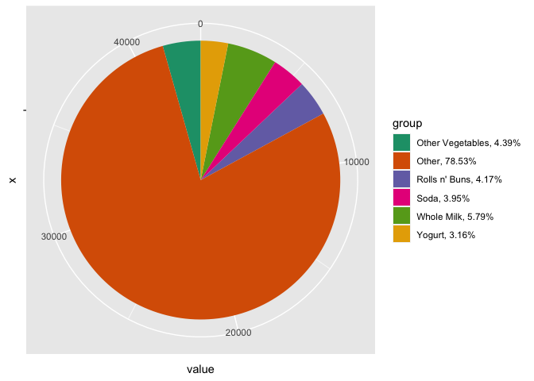<!-- -->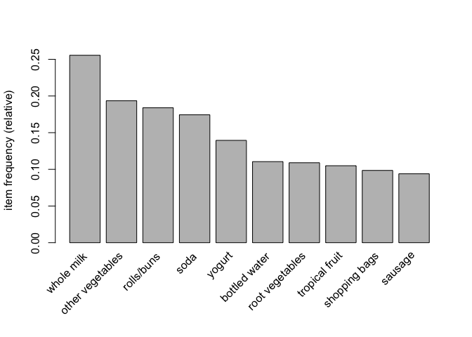<!-- -->

    ##          abrasive cleaner          artif. sweetener            baby cosmetics 
    ##              0.0035587189              0.0032536858              0.0006100661 
    ##                 baby food                      bags             baking powder 
    ##              0.0001016777              0.0004067107              0.0176919166 
    ##          bathroom cleaner                      beef                   berries 
    ##              0.0027452974              0.0524656838              0.0332486019 
    ##                 beverages              bottled beer             bottled water 
    ##              0.0260294865              0.0805287239              0.1105236401 
    ##                    brandy               brown bread                    butter 
    ##              0.0041687850              0.0648703610              0.0554143366 
    ##               butter milk                  cake bar                   candles 
    ##              0.0279613625              0.0132180986              0.0089476360 
    ##                     candy               canned beer               canned fish 
    ##              0.0298932384              0.0776817489              0.0150482969 
    ##              canned fruit         canned vegetables                  cat food 
    ##              0.0032536858              0.0107778343              0.0232841891 
    ##                   cereals               chewing gum                   chicken 
    ##              0.0056939502              0.0210472801              0.0429079817 
    ##                 chocolate     chocolate marshmallow              citrus fruit 
    ##              0.0496187087              0.0090493137              0.0827656329 
    ##                   cleaner           cling film/bags              cocoa drinks 
    ##              0.0050838841              0.0113879004              0.0022369090 
    ##                    coffee            condensed milk         cooking chocolate 
    ##              0.0580579563              0.0102694459              0.0025419420 
    ##                  cookware                     cream             cream cheese  
    ##              0.0027452974              0.0013218099              0.0396542959 
    ##                      curd               curd cheese               decalcifier 
    ##              0.0532791052              0.0050838841              0.0015251652 
    ##               dental care                   dessert                 detergent 
    ##              0.0057956279              0.0371123538              0.0192170819 
    ##              dish cleaner                    dishes                  dog food 
    ##              0.0104728012              0.0175902389              0.0085409253 
    ##             domestic eggs  female sanitary products         finished products 
    ##              0.0634468734              0.0061006609              0.0065073716 
    ##                      fish                     flour            flower (seeds) 
    ##              0.0029486528              0.0173868836              0.0103711235 
    ##    flower soil/fertilizer               frankfurter            frozen chicken 
    ##              0.0019318760              0.0589730554              0.0006100661 
    ##            frozen dessert               frozen fish             frozen fruits 
    ##              0.0107778343              0.0116929334              0.0012201322 
    ##              frozen meals    frozen potato products         frozen vegetables 
    ##              0.0283680732              0.0084392476              0.0480935435 
    ##     fruit/vegetable juice                    grapes                hair spray 
    ##              0.0722928317              0.0223690900              0.0011184545 
    ##                       ham            hamburger meat               hard cheese 
    ##              0.0260294865              0.0332486019              0.0245043213 
    ##                     herbs                     honey    house keeping products 
    ##              0.0162684291              0.0015251652              0.0083375699 
    ##          hygiene articles                 ice cream            instant coffee 
    ##              0.0329435689              0.0250127097              0.0074224708 
    ##     Instant food products                       jam                   ketchup 
    ##              0.0080325369              0.0053889171              0.0042704626 
    ##            kitchen towels           kitchen utensil               light bulbs 
    ##              0.0059989832              0.0004067107              0.0041687850 
    ##                   liqueur                    liquor        liquor (appetizer) 
    ##              0.0009150991              0.0110828673              0.0079308592 
    ##                liver loaf  long life bakery product           make up remover 
    ##              0.0050838841              0.0374173869              0.0008134215 
    ##            male cosmetics                 margarine                mayonnaise 
    ##              0.0045754957              0.0585663447              0.0091509914 
    ##                      meat              meat spreads           misc. beverages 
    ##              0.0258261312              0.0042704626              0.0283680732 
    ##                   mustard                   napkins                newspapers 
    ##              0.0119979664              0.0523640061              0.0798169802 
    ##                 nut snack               nuts/prunes                       oil 
    ##              0.0031520081              0.0033553635              0.0280630402 
    ##                    onions          organic products           organic sausage 
    ##              0.0310116929              0.0016268429              0.0022369090 
    ##          other vegetables packaged fruit/vegetables                     pasta 
    ##              0.1934926284              0.0130147433              0.0150482969 
    ##                    pastry                  pet care                photo/film 
    ##              0.0889679715              0.0094560244              0.0092526690 
    ##        pickled vegetables                 pip fruit                   popcorn 
    ##              0.0178952720              0.0756481952              0.0072191154 
    ##                      pork                pot plants           potato products 
    ##              0.0576512456              0.0172852059              0.0028469751 
    ##     preservation products          processed cheese                  prosecco 
    ##              0.0002033554              0.0165734621              0.0020335536 
    ##            pudding powder               ready soups            red/blush wine 
    ##              0.0023385867              0.0018301983              0.0192170819 
    ##                      rice            roll products                 rolls/buns 
    ##              0.0076258261              0.0102694459              0.1839349263 
    ##           root vegetables           rubbing alcohol                       rum 
    ##              0.1089984748              0.0010167768              0.0044738180 
    ##            salad dressing                      salt               salty snack 
    ##              0.0008134215              0.0107778343              0.0378240976 
    ##                    sauces                   sausage         seasonal products 
    ##              0.0054905948              0.0939501779              0.0142348754 
    ##       semi-finished bread             shopping bags                 skin care 
    ##              0.0176919166              0.0985256736              0.0035587189 
    ##             sliced cheese            snack products                      soap 
    ##              0.0245043213              0.0030503305              0.0026436197 
    ##                      soda               soft cheese                  softener 
    ##              0.1743772242              0.0170818505              0.0054905948 
    ##      sound storage medium                     soups            sparkling wine 
    ##              0.0001016777              0.0068124047              0.0055922725 
    ##             specialty bar          specialty cheese       specialty chocolate 
    ##              0.0273512964              0.0085409253              0.0304016268 
    ##             specialty fat      specialty vegetables                    spices 
    ##              0.0036603965              0.0017285206              0.0051855618 
    ##             spread cheese                     sugar             sweet spreads 
    ##              0.0111845450              0.0338586680              0.0090493137 
    ##                     syrup                       tea                   tidbits 
    ##              0.0032536858              0.0038637519              0.0023385867 
    ##            toilet cleaner            tropical fruit                    turkey 
    ##              0.0007117438              0.1049313676              0.0081342145 
    ##                  UHT-milk                   vinegar                   waffles 
    ##              0.0334519573              0.0065073716              0.0384341637 
    ##        whipped/sour cream                    whisky               white bread 
    ##              0.0716827656              0.0008134215              0.0420945602 
    ##                white wine                whole milk                    yogurt 
    ##              0.0190137265              0.2555160142              0.1395017794 
    ##                  zwieback 
    ##              0.0069140824

**Trial and Error Rule Sets:** For creating rule sets, we first used the
parameters set in the playlists.R Spotify example: *support = 0.005,
confidence = 0.1, and maxlen = 5*. These settings give 1582 rules and
lots of empty LHS rules, so for the next trial-and-error rule set, we
increased support to 0.05 and left the other parameters at their
respective levels.

The second rule set gives us only 14 rules which is much more useful,
but we still have empty LHS rules, so in the next rule sets we decided
to change *maxlen = 5* to *minlen = 2*.

    ## Apriori
    ## 
    ## Parameter specification:
    ##  confidence minval smax arem  aval originalSupport maxtime support minlen
    ##         0.1    0.1    1 none FALSE            TRUE       5    0.05      1
    ##  maxlen target  ext
    ##       5  rules TRUE
    ## 
    ## Algorithmic control:
    ##  filter tree heap memopt load sort verbose
    ##     0.1 TRUE TRUE  FALSE TRUE    2    TRUE
    ## 
    ## Absolute minimum support count: 491 
    ## 
    ## set item appearances ...[0 item(s)] done [0.00s].
    ## set transactions ...[169 item(s), 9835 transaction(s)] done [0.00s].
    ## sorting and recoding items ... [28 item(s)] done [0.00s].
    ## creating transaction tree ... done [0.00s].
    ## checking subsets of size 1 2 done [0.00s].
    ## writing ... [14 rule(s)] done [0.00s].
    ## creating S4 object  ... done [0.00s].

    ##      lhs                   rhs                support    confidence coverage 
    ## [1]  {}                 => {bottled water}    0.11052364 0.1105236  1.0000000
    ## [2]  {}                 => {tropical fruit}   0.10493137 0.1049314  1.0000000
    ## [3]  {}                 => {root vegetables}  0.10899847 0.1089985  1.0000000
    ## [4]  {}                 => {soda}             0.17437722 0.1743772  1.0000000
    ## [5]  {}                 => {yogurt}           0.13950178 0.1395018  1.0000000
    ## [6]  {}                 => {rolls/buns}       0.18393493 0.1839349  1.0000000
    ## [7]  {}                 => {other vegetables} 0.19349263 0.1934926  1.0000000
    ## [8]  {}                 => {whole milk}       0.25551601 0.2555160  1.0000000
    ## [9]  {yogurt}           => {whole milk}       0.05602440 0.4016035  0.1395018
    ## [10] {whole milk}       => {yogurt}           0.05602440 0.2192598  0.2555160
    ## [11] {rolls/buns}       => {whole milk}       0.05663447 0.3079049  0.1839349
    ## [12] {whole milk}       => {rolls/buns}       0.05663447 0.2216474  0.2555160
    ## [13] {other vegetables} => {whole milk}       0.07483477 0.3867578  0.1934926
    ## [14] {whole milk}       => {other vegetables} 0.07483477 0.2928770  0.2555160
    ##      lift     count
    ## [1]  1.000000 1087 
    ## [2]  1.000000 1032 
    ## [3]  1.000000 1072 
    ## [4]  1.000000 1715 
    ## [5]  1.000000 1372 
    ## [6]  1.000000 1809 
    ## [7]  1.000000 1903 
    ## [8]  1.000000 2513 
    ## [9]  1.571735  551 
    ## [10] 1.571735  551 
    ## [11] 1.205032  557 
    ## [12] 1.205032  557 
    ## [13] 1.513634  736 
    ## [14] 1.513634  736

**Final 15 Rules:** In our final rule set, whole milk is the most common
rhs (i.e., its the most predictable); this makes sense because it’s the
most commonly bought item.

    ## Apriori
    ## 
    ## Parameter specification:
    ##  confidence minval smax arem  aval originalSupport maxtime support minlen
    ##         0.5    0.1    1 none FALSE            TRUE       5    0.01      2
    ##  maxlen target  ext
    ##      10  rules TRUE
    ## 
    ## Algorithmic control:
    ##  filter tree heap memopt load sort verbose
    ##     0.1 TRUE TRUE  FALSE TRUE    2    TRUE
    ## 
    ## Absolute minimum support count: 98 
    ## 
    ## set item appearances ...[0 item(s)] done [0.00s].
    ## set transactions ...[169 item(s), 9835 transaction(s)] done [0.01s].
    ## sorting and recoding items ... [88 item(s)] done [0.00s].
    ## creating transaction tree ... done [0.01s].
    ## checking subsets of size 1 2 3 4 done [0.00s].
    ## writing ... [15 rule(s)] done [0.00s].
    ## creating S4 object  ... done [0.00s].

    ##      lhs                                      rhs                support   
    ## [1]  {curd,yogurt}                         => {whole milk}       0.01006609
    ## [2]  {butter,other vegetables}             => {whole milk}       0.01148958
    ## [3]  {domestic eggs,other vegetables}      => {whole milk}       0.01230300
    ## [4]  {whipped/sour cream,yogurt}           => {whole milk}       0.01087951
    ## [5]  {other vegetables,whipped/sour cream} => {whole milk}       0.01464159
    ## [6]  {other vegetables,pip fruit}          => {whole milk}       0.01352313
    ## [7]  {citrus fruit,root vegetables}        => {other vegetables} 0.01037112
    ## [8]  {root vegetables,tropical fruit}      => {other vegetables} 0.01230300
    ## [9]  {root vegetables,tropical fruit}      => {whole milk}       0.01199797
    ## [10] {tropical fruit,yogurt}               => {whole milk}       0.01514997
    ## [11] {root vegetables,yogurt}              => {other vegetables} 0.01291307
    ## [12] {root vegetables,yogurt}              => {whole milk}       0.01453991
    ## [13] {rolls/buns,root vegetables}          => {other vegetables} 0.01220132
    ## [14] {rolls/buns,root vegetables}          => {whole milk}       0.01270971
    ## [15] {other vegetables,yogurt}             => {whole milk}       0.02226741
    ##      confidence coverage   lift     count
    ## [1]  0.5823529  0.01728521 2.279125  99  
    ## [2]  0.5736041  0.02003050 2.244885 113  
    ## [3]  0.5525114  0.02226741 2.162336 121  
    ## [4]  0.5245098  0.02074225 2.052747 107  
    ## [5]  0.5070423  0.02887646 1.984385 144  
    ## [6]  0.5175097  0.02613116 2.025351 133  
    ## [7]  0.5862069  0.01769192 3.029608 102  
    ## [8]  0.5845411  0.02104728 3.020999 121  
    ## [9]  0.5700483  0.02104728 2.230969 118  
    ## [10] 0.5173611  0.02928317 2.024770 149  
    ## [11] 0.5000000  0.02582613 2.584078 127  
    ## [12] 0.5629921  0.02582613 2.203354 143  
    ## [13] 0.5020921  0.02430097 2.594890 120  
    ## [14] 0.5230126  0.02430097 2.046888 125  
    ## [15] 0.5128806  0.04341637 2.007235 219

    ## Warning: Unknown control parameters: by

    ## Available control parameters (with default values):
    ## main  =  Graph for 15 rules
    ## nodeColors    =  c("#66CC6680", "#9999CC80")
    ## nodeCol   =  c("#EE0000FF", "#EE0303FF", "#EE0606FF", "#EE0909FF", "#EE0C0CFF", "#EE0F0FFF", "#EE1212FF", "#EE1515FF", "#EE1818FF", "#EE1B1BFF", "#EE1E1EFF", "#EE2222FF", "#EE2525FF", "#EE2828FF", "#EE2B2BFF", "#EE2E2EFF", "#EE3131FF", "#EE3434FF", "#EE3737FF", "#EE3A3AFF", "#EE3D3DFF", "#EE4040FF", "#EE4444FF", "#EE4747FF", "#EE4A4AFF", "#EE4D4DFF", "#EE5050FF", "#EE5353FF", "#EE5656FF", "#EE5959FF", "#EE5C5CFF", "#EE5F5FFF", "#EE6262FF", "#EE6666FF", "#EE6969FF", "#EE6C6CFF", "#EE6F6FFF", "#EE7272FF", "#EE7575FF",  "#EE7878FF", "#EE7B7BFF", "#EE7E7EFF", "#EE8181FF", "#EE8484FF", "#EE8888FF", "#EE8B8BFF", "#EE8E8EFF", "#EE9191FF", "#EE9494FF", "#EE9797FF", "#EE9999FF", "#EE9B9BFF", "#EE9D9DFF", "#EE9F9FFF", "#EEA0A0FF", "#EEA2A2FF", "#EEA4A4FF", "#EEA5A5FF", "#EEA7A7FF", "#EEA9A9FF", "#EEABABFF", "#EEACACFF", "#EEAEAEFF", "#EEB0B0FF", "#EEB1B1FF", "#EEB3B3FF", "#EEB5B5FF", "#EEB7B7FF", "#EEB8B8FF", "#EEBABAFF", "#EEBCBCFF", "#EEBDBDFF", "#EEBFBFFF", "#EEC1C1FF", "#EEC3C3FF", "#EEC4C4FF", "#EEC6C6FF", "#EEC8C8FF",  "#EEC9C9FF", "#EECBCBFF", "#EECDCDFF", "#EECFCFFF", "#EED0D0FF", "#EED2D2FF", "#EED4D4FF", "#EED5D5FF", "#EED7D7FF", "#EED9D9FF", "#EEDBDBFF", "#EEDCDCFF", "#EEDEDEFF", "#EEE0E0FF", "#EEE1E1FF", "#EEE3E3FF", "#EEE5E5FF", "#EEE7E7FF", "#EEE8E8FF", "#EEEAEAFF", "#EEECECFF", "#EEEEEEFF")
    ## edgeCol   =  c("#474747FF", "#494949FF", "#4B4B4BFF", "#4D4D4DFF", "#4F4F4FFF", "#515151FF", "#535353FF", "#555555FF", "#575757FF", "#595959FF", "#5B5B5BFF", "#5E5E5EFF", "#606060FF", "#626262FF", "#646464FF", "#666666FF", "#686868FF", "#6A6A6AFF", "#6C6C6CFF", "#6E6E6EFF", "#707070FF", "#727272FF", "#747474FF", "#767676FF", "#787878FF", "#7A7A7AFF", "#7C7C7CFF", "#7E7E7EFF", "#808080FF", "#828282FF", "#848484FF", "#868686FF", "#888888FF", "#8A8A8AFF", "#8C8C8CFF", "#8D8D8DFF", "#8F8F8FFF", "#919191FF", "#939393FF",  "#959595FF", "#979797FF", "#999999FF", "#9A9A9AFF", "#9C9C9CFF", "#9E9E9EFF", "#A0A0A0FF", "#A2A2A2FF", "#A3A3A3FF", "#A5A5A5FF", "#A7A7A7FF", "#A9A9A9FF", "#AAAAAAFF", "#ACACACFF", "#AEAEAEFF", "#AFAFAFFF", "#B1B1B1FF", "#B3B3B3FF", "#B4B4B4FF", "#B6B6B6FF", "#B7B7B7FF", "#B9B9B9FF", "#BBBBBBFF", "#BCBCBCFF", "#BEBEBEFF", "#BFBFBFFF", "#C1C1C1FF", "#C2C2C2FF", "#C3C3C4FF", "#C5C5C5FF", "#C6C6C6FF", "#C8C8C8FF", "#C9C9C9FF", "#CACACAFF", "#CCCCCCFF", "#CDCDCDFF", "#CECECEFF", "#CFCFCFFF", "#D1D1D1FF",  "#D2D2D2FF", "#D3D3D3FF", "#D4D4D4FF", "#D5D5D5FF", "#D6D6D6FF", "#D7D7D7FF", "#D8D8D8FF", "#D9D9D9FF", "#DADADAFF", "#DBDBDBFF", "#DCDCDCFF", "#DDDDDDFF", "#DEDEDEFF", "#DEDEDEFF", "#DFDFDFFF", "#E0E0E0FF", "#E0E0E0FF", "#E1E1E1FF", "#E1E1E1FF", "#E2E2E2FF", "#E2E2E2FF", "#E2E2E2FF")
    ## alpha     =  0.5
    ## cex   =  1
    ## itemLabels    =  TRUE
    ## labelCol  =  #000000B3
    ## measureLabels     =  FALSE
    ## precision     =  3
    ## layout    =  NULL
    ## layoutParams  =  list()
    ## arrowSize     =  0.5
    ## engine    =  igraph
    ## plot  =  TRUE
    ## plot_options  =  list()
    ## max   =  100
    ## verbose   =  FALSE

<!-- --><!-- -->
